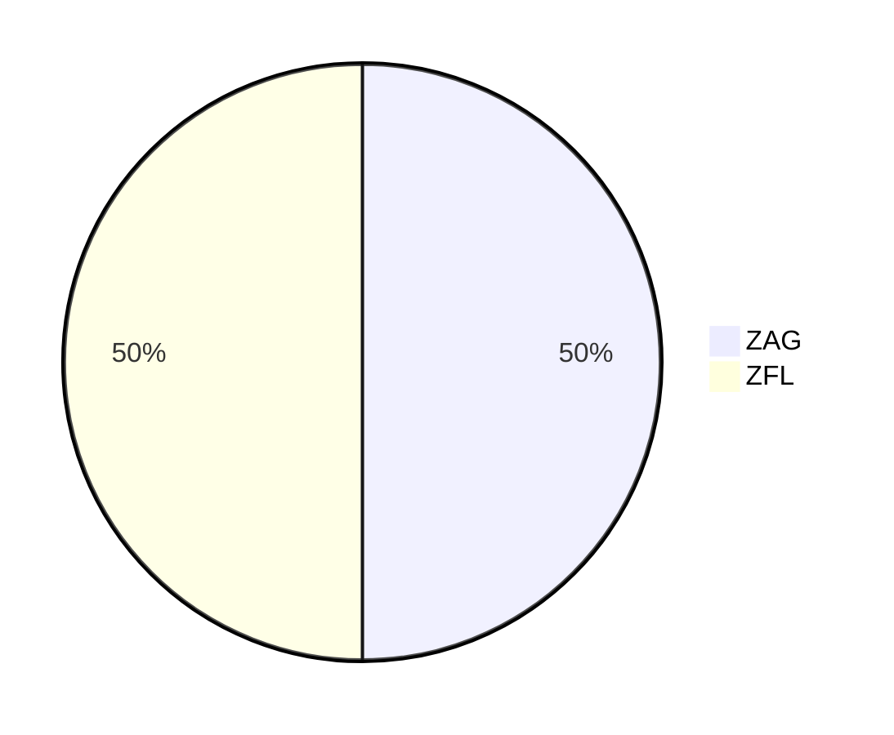
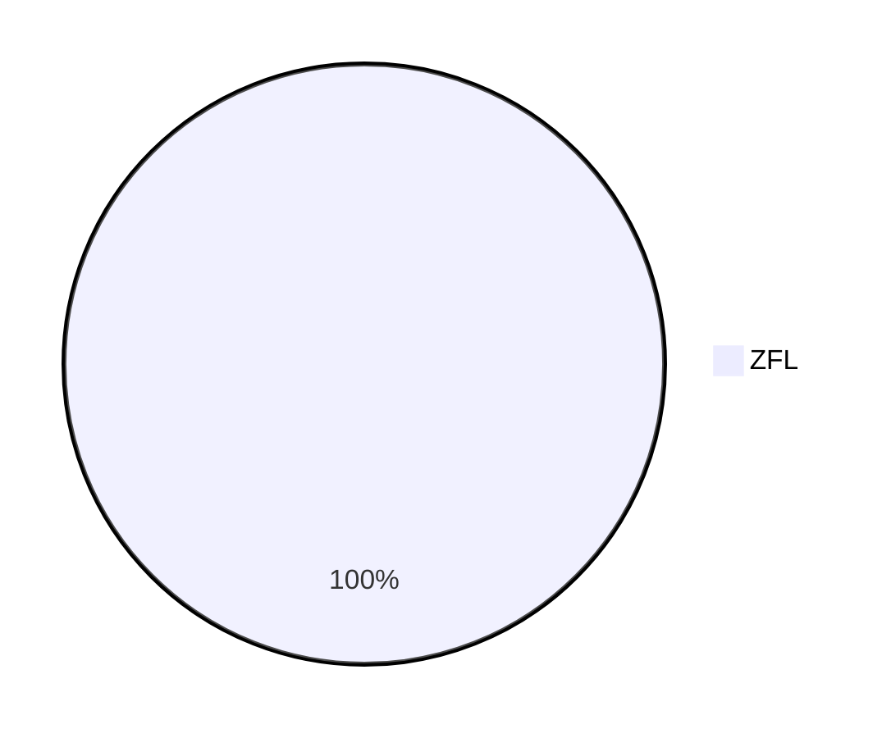
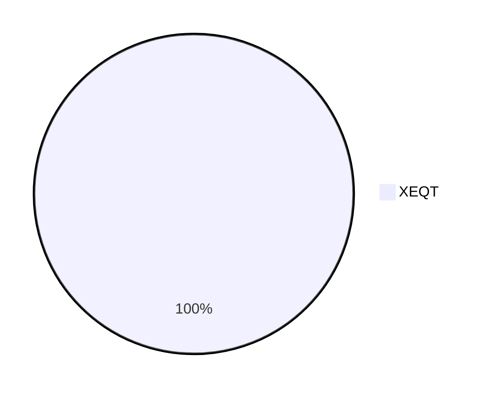
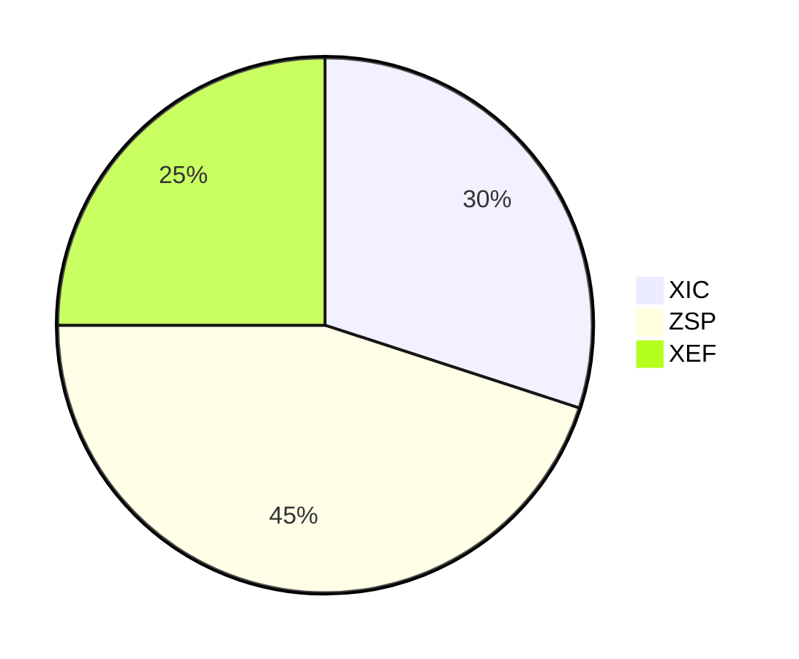
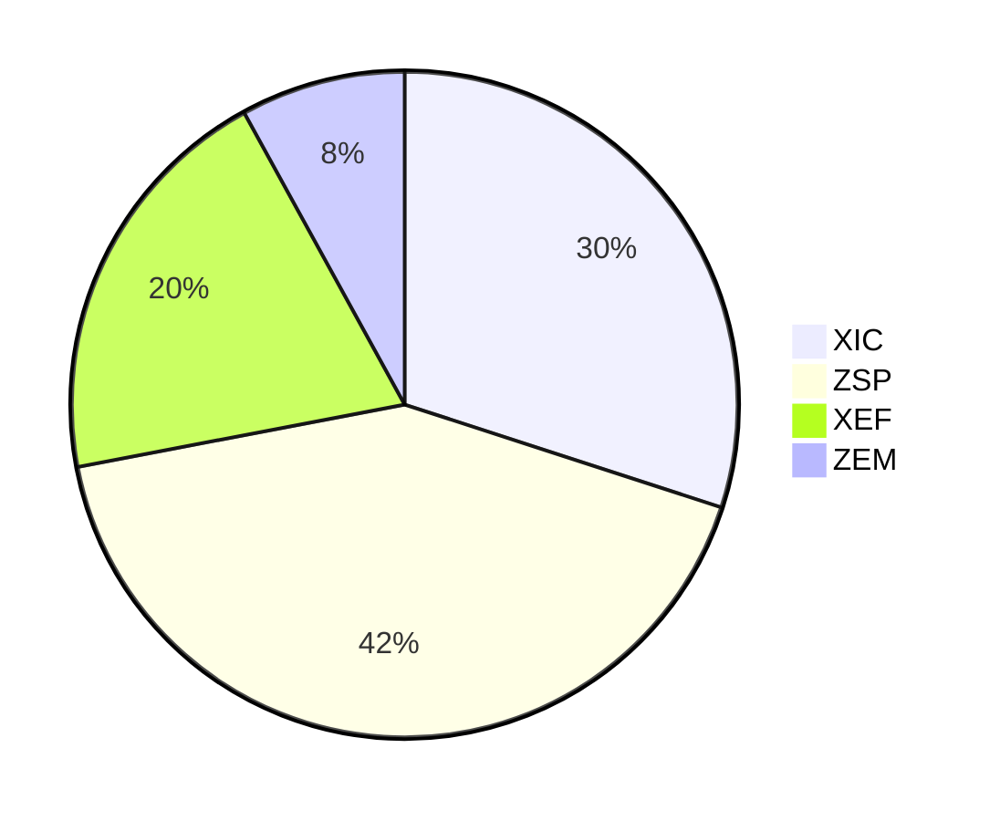

## Bonds

### For 60/40 Portfolio

```mermaid
pie
"ZAG" : 50
"ZFL" : 50
```

### For 80/20 Portfolio

```mermaid
pie
"ZFL" : 100
```

## Stocks

### One fund solution

```mermaid
pie
"XEQT" : 100
```

### Developed Markets only

```mermaid
pie
"XIC" : 30
"ZSP" : 45
"XEF" : 25
```

#### Including Emerging Markets

```mermaid
pie
"XIC" : 30
"ZSP" : 42
"XEF" : 20
"ZEM" : 8
```
