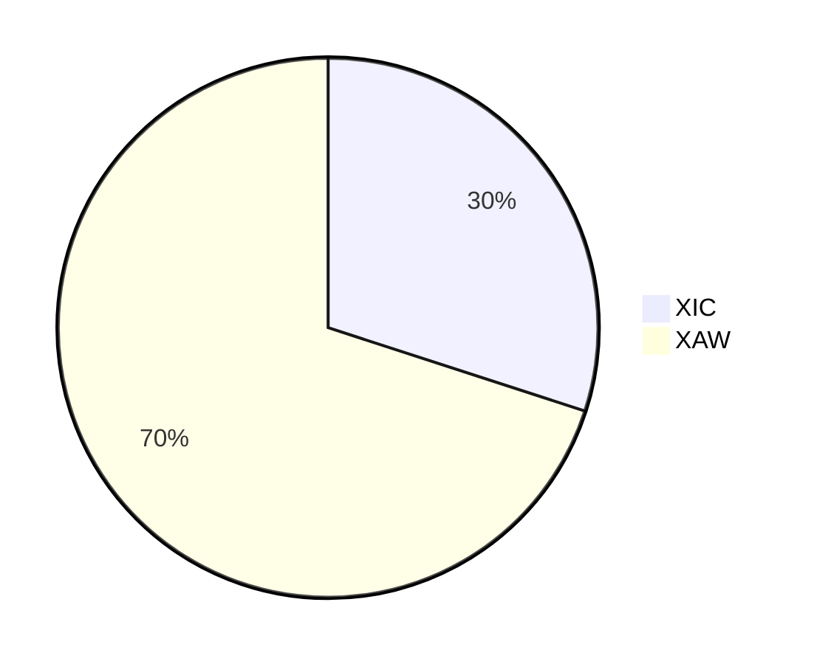
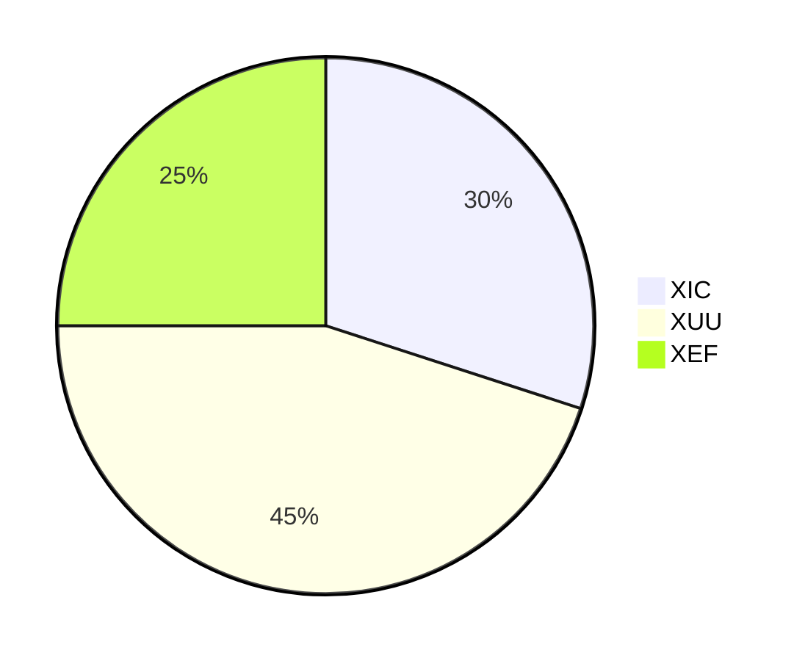
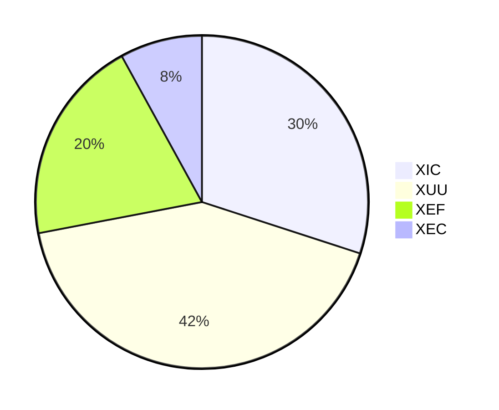

# Example Canadian Couch Potato Portfolios

The following are examples.

## Cash equivalents

CBIL

## Bonds

ZAG

## Stocks

### One Fund Solution

VEQT

### 2-Fund Portfolio

### 3-Fund Portfolio

For ex-Canada allocation, either follow market cap weights or fixed weights. This 3-Fund Portfolio does not include emerging markets equities.

### 4-Fund Portfolio

For ex-Canada allocation, either follow market cap weights or fixed weights. The 4-Fund Portfolio includes emerging markets equities.

