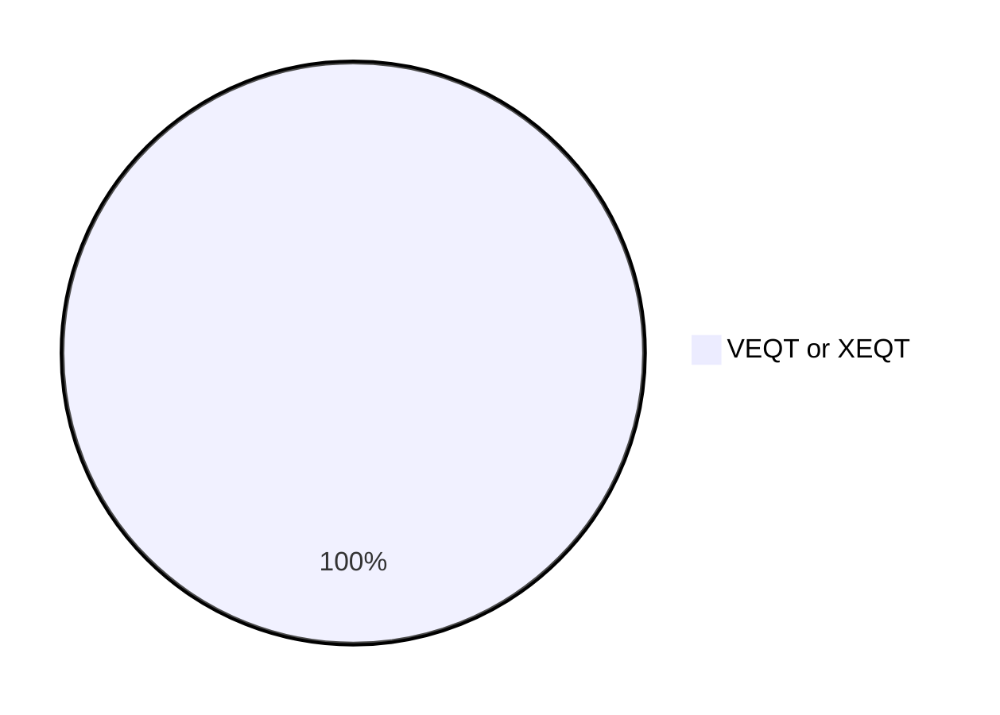
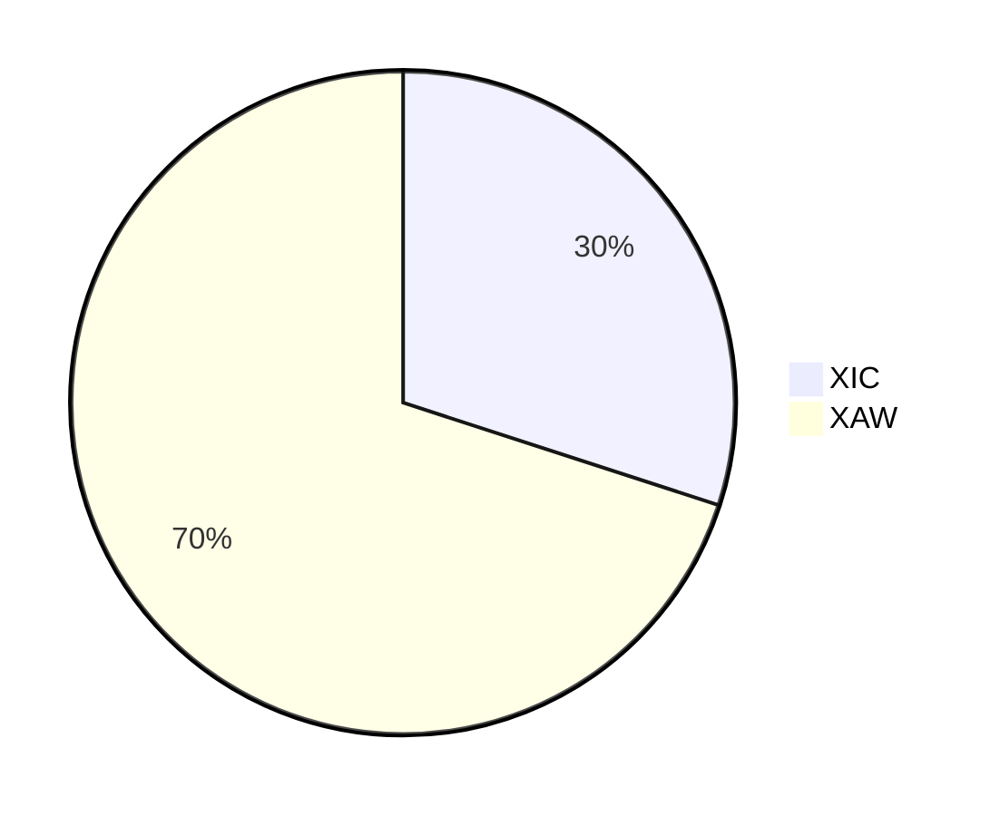
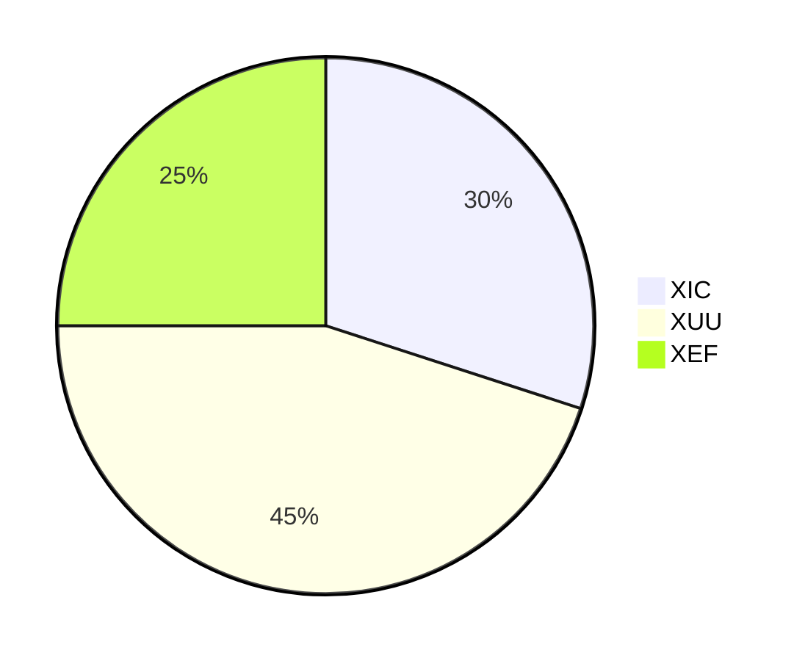

# Example Canadian Couch Potato Portfolios

The following are examples.

## Bonds

ZAG

## Stocks

### One Fund Solution

Choose from VEQT or XEQT. I prefer 30% to Canadian equities. XEQT has lower MER.

### 2-Fund Solution

### 3-Fund Solution

This 3-Fund Solution does not include emerging markets equities - however, I think it's okay.

