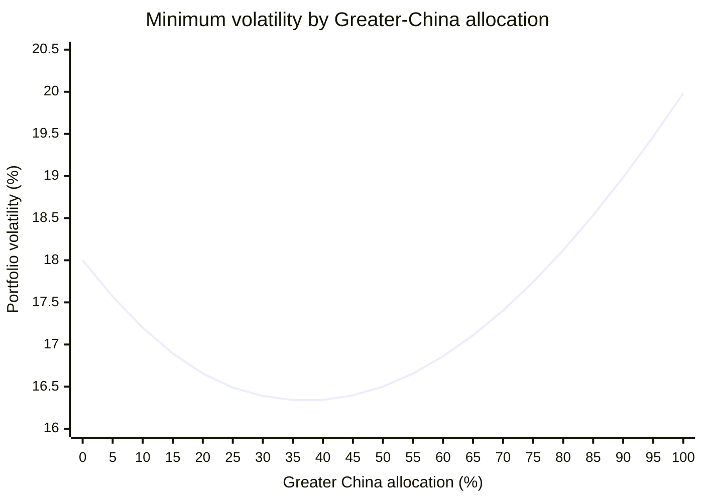
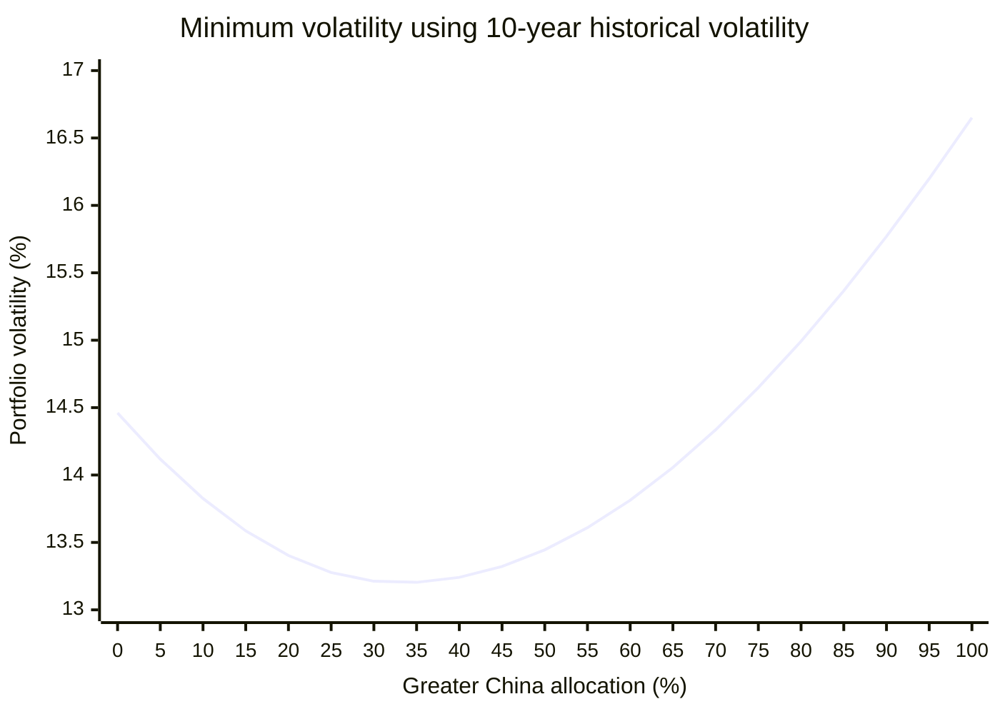

# Equity allocation across regional markets

The core analysis estimates long-only allocations within the **equity sleeve** across:

- A-shares, represented by the CSI 800;
- Hong Kong-listed stocks, represented by the Hang Seng Index; and
- U.S. large-cap stocks, represented by the S&P 500.

An exploratory extension later adds European and Japanese stocks using hypothetical higher-cost funds. It is kept separate because the fund-specific tax treatment and tracking costs have not been verified.

The stock/bond decision comes first. All weights below sum to 100% of stocks, not the total portfolio.

_Last updated: 2026. Assumptions are uncertain and implementation costs, taxes, fund access, and regulations may change._

**Not financial advice.** This is a planning framework, not a personal recommendation.

## Summary

The core three-market optimizer does not identify one reliable exact allocation. Depending on reasonable inputs, the results range from roughly:

- 29%-49% A-shares;
- 0%-30% Hong Kong-listed stocks; and
- 40%-67% U.S. stocks.

The most stable conclusions are:

1. U.S. stocks receive the largest weight in most cases because of their lower assumed volatility and diversification benefit.
2. Hong Kong receives the least stable weight. Historical volatility and implementation costs generally reduce its allocation, which reaches zero in the constant-return net-of-cost cases.
3. Equal expected returns make maximum proxy Sharpe equivalent to minimum variance.
4. Estimated returns, fees, and volatility materially change the result. Optimized weights should therefore be rounded and treated as evidence, not precise targets.
5. Mean-variance utility provides one coherent return-risk objective, but its result still depends on risk aversion and how uncertainty across input models is handled.

The existing **18/12/70** allocation remains a simple policy benchmark with a stronger U.S. tilt than every reported optimized case. With risk aversion \(\gamma=3\), equally weighting the two net-return models and two covariance models produces **40/0/60** after rounding. If policy requires at least 5% in Hong Kong, the best allocation on a 5-percentage-point grid is **40/5/55**. A more conservative maximin-utility rule produces **35/10/55** after rounding. These are outputs of different explicit decision rules, not uniquely optimal allocations.

In the exploratory five-market model, Europe receives zero weight at every tested risk-aversion level because its high fee and strong correlation with U.S. stocks outweigh its diversification benefit. Japan receives 0%, 5%, and 15% after rounding at \(\gamma=1,3,5\), respectively. Hong Kong also falls to zero in the equal-weighted model-average results, although it remains positive under the conservative maximin rule at \(\gamma=3\) and \(\gamma=5\).

## Inputs

### Returns and volatility

| Asset class             | Base expected return | Assumed volatility | 10-year historical volatility |
| ----------------------- | -------------------: | -----------------: | ----------------------------: |
| A-shares                |                 7.5% |                22% |                        17.86% |
| Hong Kong-listed stocks |                 8.0% |                22% |                        18.90% |
| U.S. large-cap stocks   |                 6.5% |                18% |                        14.46% |

### Correlations

| Asset class             | A-shares | Hong Kong | U.S. stocks |
| ----------------------- | -------: | --------: | ----------: |
| A-shares                |     1.00 |      0.65 |        0.40 |
| Hong Kong-listed stocks |     0.65 |      1.00 |        0.55 |
| U.S. large-cap stocks   |     0.40 |      0.55 |        1.00 |

### Fees and withholding tax

| Asset class             | Gross base return | Fund fee | Est. withholding tax | Net base return | Net return from 7% common return |
| ----------------------- | ----------------: | -------: | -------------------: | --------------: | -------------------------------: |
| A-shares                |             7.50% |    0.29% |                0.00% |           7.21% |                            6.71% |
| Hong Kong-listed stocks |             8.00% |    0.61% |                0.62% |           6.77% |                            5.77% |
| U.S. large-cap stocks   |             6.50% |    0.68% |                0.11% |           5.71% |                            6.21% |

## Method

Constraints for every optimization:

- fully invested: weights sum to 100%;
- long-only: every weight is between 0% and 100%.

Portfolio volatility is:

$$
\sigma_p = \sqrt{\mathbf{w}^{\mathsf T}\Sigma\mathbf{w}}
$$

The minimum-volatility portfolio solves:

$$
\min_{\mathbf{w}}\; \mathbf{w}^{\mathsf T}\Sigma\mathbf{w}
$$

The maximum-proxy-Sharpe portfolio uses a 2% risk-free rate and solves:

$$
\max_{\mathbf{w}}\; \frac{\mathbf{w}^{\mathsf T}\boldsymbol{\mu} - 2\%}{\sqrt{\mathbf{w}^{\mathsf T}\Sigma\mathbf{w}}}
$$

The mean-variance expected-utility portfolio uses risk aversion \(\gamma=3\) and solves:

$$
\max_{\mathbf{w}}\; \mathbf{w}^{\mathsf T}\boldsymbol{\mu}_{\mathrm{net}} - \frac{3}{2}\mathbf{w}^{\mathsf T}\Sigma\mathbf{w}
$$

Because every portfolio is fully invested in risky assets, subtracting a constant risk-free rate would not change the expected-utility weights. The planning returns are compound-return assumptions. Strictly, Sharpe and mean-variance utility require expected arithmetic returns. The reported values are therefore planning approximations, reinforcing the need to avoid false precision.

## Minimum-volatility results

Expected returns do not enter a pure minimum-volatility optimization. Changing return assumptions alone cannot change these weights.

| Volatility case               | A-shares | Hong Kong | U.S. stocks | Portfolio volatility |
| ----------------------------- | -------: | --------: | ----------: | -------------------: |
| Base assumed volatility       |   29.63% |     7.64% |      62.73% |               16.33% |
| 10-year historical volatility |   32.52% |     0.72% |      66.76% |               13.20% |

The historical-volatility case nearly eliminates Hong Kong because it has the highest volatility and the highest correlation with U.S. stocks. The lower modeled portfolio volatility should not be read as a forecast; it largely reflects the lower historical inputs.

### Greater-China allocation and volatility

The following figure uses the base volatility and correlation assumptions. At each Greater-China weight, the A-share/Hong Kong split is chosen to minimize volatility; U.S. stocks receive the remaining weight.

The global minimum occurs at **37.27% Greater China**, divided into 29.63% A-shares and 7.64% Hong Kong, with 62.73% in U.S. stocks. Modeled volatility is 16.33%.

At **30% Greater China**, the conditional minimum is 27.27% A-shares, 2.73% Hong Kong, and 70% U.S. stocks, producing 16.39% volatility. The existing 18/12/70 policy allocation also has 30% Greater China but produces slightly higher modeled volatility of 16.48% because its Hong Kong weight is higher. The 0.09-percentage-point difference is economically small relative to estimation uncertainty.

### Greater-China allocation using 10-year historical volatility

This figure replaces the base volatility assumptions with the 10-year historical volatilities. It retains the planning correlations and again minimizes volatility over the A-share/Hong Kong split at each Greater-China weight.

The global minimum occurs at **33.24% Greater China**, divided into 32.52% A-shares and 0.72% Hong Kong, with 66.76% in U.S. stocks. Modeled volatility is 13.20%.

At **30% Greater China**, the conditional minimum is 30% A-shares, 0% Hong Kong, and 70% U.S. stocks, producing 13.21% volatility. The existing 18/12/70 policy allocation produces 13.37%. This 0.16-percentage-point difference remains small relative to estimation uncertainty.

## Maximum proxy-Sharpe results

### Base volatility

| Return case                     | A-shares | Hong Kong | U.S. stocks | Portfolio return | Portfolio volatility | Proxy Sharpe ratio |
| ------------------------------- | -------: | --------: | ----------: | ---------------: | -------------------: | -----------------: |
| Base expected returns           |   28.62% |    30.23% |      41.14% |            7.24% |               16.87% |              0.311 |
| Base returns minus fees and tax |   45.12% |    14.66% |      40.22% |            6.54% |               16.92% |              0.269 |
| Constant 7% returns             |   29.63% |     7.64% |      62.73% |            7.00% |               16.33% |              0.306 |
| Constant 7% minus fees and tax  |   39.95% |     0.00% |      60.05% |            6.41% |               16.43% |              0.268 |

The base-return case gives Hong Kong a large weight because it combines the highest assumed gross return with imperfect correlation. This result disappears when returns are equalized or costs are deducted. It is therefore especially sensitive to uncertain inputs.

### Alternative: 10-year historical volatility

This sensitivity test reruns every return case with historical volatilities while retaining the planning correlation matrix.

| Return case                     | A-shares | Hong Kong | U.S. stocks | Portfolio return | Portfolio volatility | Proxy Sharpe ratio |
| ------------------------------- | -------: | --------: | ----------: | ---------------: | -------------------: | -----------------: |
| Base expected returns           |   32.74% |    20.92% |      46.34% |            7.14% |               13.61% |              0.378 |
| Base returns minus fees and tax |   48.63% |     6.65% |      44.72% |            6.51% |               13.67% |              0.330 |
| Constant 7% returns             |   32.52% |     0.72% |      66.76% |            7.00% |               13.20% |              0.379 |
| Constant 7% minus fees and tax  |   39.10% |     0.00% |      60.90% |            6.41% |               13.25% |              0.333 |

Historical volatility generally raises A-share and U.S. weights while reducing Hong Kong. The proxy Sharpe ratios are higher mainly because all three historical volatilities are below the conservative planning assumptions, not because the portfolios are necessarily better.

## Mean-variance expected utility

This analysis applies the same expected-utility objective with \(\gamma=3\) to four input scenarios:

- base net returns and net returns from a common 7% gross return; and
- assumed volatility and 10-year historical volatility.

Fees and estimated withholding tax are deducted in every scenario. Correlations remain fixed at the planning values. No minimum regional allocation is imposed.

| Return model      | Volatility model | A-shares | Hong Kong | U.S. stocks | Portfolio return | Portfolio volatility | Utility score |
| ----------------- | ---------------- | -------: | --------: | ----------: | ---------------: | -------------------: | ------------: |
| Base net          | Assumed          |   37.83% |    11.35% |      50.82% |            6.40% |               16.50% |         2.31% |
| Common-return net | Assumed          |   37.11% |     0.00% |      62.89% |            6.40% |               16.39% |         2.36% |
| Base net          | Historical       |   45.48% |     5.49% |      49.04% |            6.45% |               13.51% |         3.71% |
| Common-return net | Historical       |   38.09% |     0.00% |      61.91% |            6.40% |               13.23% |         3.77% |

The utility score is return-equivalent: expected net return minus \(3/2\) times portfolio variance. It is useful for ranking portfolios under the stated model, not as a forecast return.

### Handling model uncertainty

Minimum volatility and maximum Sharpe are different objectives, so averaging their optimized weights would not be principled. Expected utility instead keeps one objective and changes only the uncertain inputs.

Two transparent rules give different answers:

| Decision rule                | A-shares | Hong Kong | U.S. stocks | Rounded policy | Interpretation                                                               |
| ---------------------------- | -------: | --------: | ----------: | -------------- | ---------------------------------------------------------------------------- |
| Equal-weighted model average |   41.10% |     0.93% |      57.97% | **40/0/60**    | Maximizes average utility when all four input scenarios receive equal weight |
| Maximin utility              |   37.98% |     8.01% |      54.01% | **35/10/55**   | Maximizes utility in the worst of the four input scenarios                   |

Equal scenario weights are a transparent default, not empirically estimated probabilities. The equal-weighted result uses the average net-return vector and average covariance matrix. If policy requires at least 5% in Hong Kong and weights are restricted to 5-percentage-point increments, its best rounded allocation is **40/5/55**.

The maximin rule is more conservative because it protects the weakest modeled outcome. Neither rule removes input uncertainty; each states explicitly how the decision treats it.

## Exploratory extension: Europe and Japan

This extension adds Europe, represented by the MSCI Europe Index, and Japan, represented by the MSCI Japan Index. It answers whether broader geographic diversification can overcome the higher implementation costs of the available hypothetical funds.

### Additional assumptions

| Input                              | Europe |  Japan |
| ---------------------------------- | -----: | -----: |
| Gross base expected return         |  7.00% |  6.50% |
| Management expense ratio           |  1.52% |  1.41% |
| Current index dividend yield       |  2.89% |  2.02% |
| Assumed effective withholding rate |    15% |    10% |
| Estimated withholding-tax drag     |  0.43% |  0.20% |
| Net base return                    |  5.05% |  4.89% |
| Net return from 7% common return   |  5.05% |  5.39% |
| Assumed volatility                 |    20% |    20% |
| 10-year historical volatility      | 16.31% | 14.13% |

The net-return calculations are:

$$
\mu_{\mathrm{net}} = \mu_{\mathrm{gross}} - \mathrm{MER} - (\mathrm{dividend\ yield} \times \mathrm{withholding\ rate})
$$

The dividend yields and historical volatilities come from the [MSCI Europe Index](https://www.msci.com/indexes/index/990500/msci-europe-index) data as of May 29, 2026, and the [MSCI Japan Index factsheet](https://www.msci.com/documents/10199/255599/msci-japan-index.pdf) as of March 31, 2026. These index volatilities are historical reference points, not unhedged-CNY investor results.

Japan's 10% assumption follows the portfolio-dividend ceiling in the [China-Japan tax treaty](https://www.chinatax.gov.cn/chinatax/n810341/n810770/c1153042/5026995/files/China-Japan-20220805112103347.pdf). Europe's 15% is a planning placeholder across countries with [different withholding regimes](https://taxation-customs.ec.europa.eu/taxation/personal-taxation/taxation-dividends-received-individuals_fr), not one statutory index-wide rate. Actual drag depends on fund domicile, legal structure, holdings, treaty eligibility, and reclaim practices. The two assumed gross returns are planning inputs rather than forecasts.

### Five-market correlation assumptions

| Asset class             | A-shares | Hong Kong | U.S. stocks | Europe | Japan |
| ----------------------- | -------: | --------: | ----------: | -----: | ----: |
| A-shares                |     1.00 |      0.65 |        0.40 |   0.40 |  0.45 |
| Hong Kong-listed stocks |     0.65 |      1.00 |        0.55 |   0.55 |  0.60 |
| U.S. large-cap stocks   |     0.40 |      0.55 |        1.00 |   0.80 |  0.65 |
| European stocks         |     0.40 |      0.55 |        0.80 |   1.00 |  0.65 |
| Japanese stocks         |     0.45 |      0.60 |        0.65 |   0.65 |  1.00 |

These are conservative long-term planning assumptions, not historical estimates. Europe is modeled as strongly correlated with U.S. stocks. Japan receives a somewhat larger diversification benefit.

### Scenario-specific expected-utility results

The optimizer uses the same four input scenarios as the core analysis: two net-return models crossed with two volatility models. No regional minimum weight is imposed.

| \(\gamma\) | Return model      | Volatility model | A-shares | Hong Kong | U.S. stocks | Europe |  Japan |
| ---------: | ----------------- | ---------------- | -------: | --------: | ----------: | -----: | -----: |
|          1 | Base net          | Assumed          |   54.22% |    18.78% |      27.00% |  0.00% |  0.00% |
|          1 | Common-return net | Assumed          |   43.89% |     0.00% |      56.11% |  0.00% |  0.00% |
|          1 | Base net          | Historical       |   71.40% |    15.02% |      13.58% |  0.00% |  0.00% |
|          1 | Common-return net | Historical       |   48.46% |     0.00% |      51.54% |  0.00% |  0.00% |
|          3 | Base net          | Assumed          |   37.83% |    11.35% |      50.82% |  0.00% |  0.00% |
|          3 | Common-return net | Assumed          |   35.38% |     0.00% |      58.08% |  0.00% |  6.54% |
|          3 | Base net          | Historical       |   44.85% |     4.50% |      46.33% |  0.00% |  4.33% |
|          3 | Common-return net | Historical       |   34.52% |     0.00% |      52.20% |  0.00% | 13.28% |
|          5 | Base net          | Assumed          |   33.72% |     7.68% |      51.02% |  0.00% |  7.58% |
|          5 | Common-return net | Assumed          |   32.51% |     0.00% |      55.21% |  0.00% | 12.28% |
|          5 | Base net          | Historical       |   37.01% |     0.00% |      43.56% |  0.00% | 19.43% |
|          5 | Common-return net | Historical       |   29.58% |     0.00% |      46.50% |  0.00% | 23.93% |

Higher risk aversion increases the penalty on variance. The optimizer therefore shifts from higher-return A-shares toward lower-volatility U.S. and Japanese stocks as \(\gamma\) rises.

### Results under model uncertainty

The equal-weighted model-average rule assigns the four input scenarios equal weight and maximizes average utility. The maximin rule instead maximizes utility in the weakest scenario.

| Rule                         | \(\gamma\) | A-shares | Hong Kong | U.S. stocks | Europe |  Japan | Rounded policy   |
| ---------------------------- | ---------: | -------: | --------: | ----------: | -----: | -----: | ---------------- |
| Equal-weighted model average |          1 |   58.01% |     0.00% |      41.99% |  0.00% |  0.00% | **60/0/40/0/0**  |
| Equal-weighted model average |          3 |   39.92% |     0.00% |      53.77% |  0.00% |  6.31% | **40/0/55/0/5**  |
| Equal-weighted model average |          5 |   34.38% |     0.00% |      50.82% |  0.00% | 14.81% | **35/0/50/0/15** |
| Maximin utility              |          1 |   50.00% |     0.00% |      50.00% |  0.00% |  0.00% | **50/0/50/0/0**  |
| Maximin utility              |          3 |   37.85% |     8.10% |      53.07% |  0.00% |  0.98% | **35/10/55/0/0** |
| Maximin utility              |          5 |   33.72% |     7.68% |      51.02% |  0.00% |  7.58% | **35/5/50/0/10** |

Weights in each rounded policy follow the order **A-shares / Hong Kong / U.S. / Europe / Japan** and are selected on a 5-percentage-point grid.

### Interpretation

Europe receives zero weight in every scenario. Its 1.52% expense ratio reduces its modeled net return, while its 0.80 correlation with U.S. stocks makes much of its risk exposure redundant. This is a corner solution under these assumptions, not proof that European stocks have no investment value.

Hong Kong also receives zero weight in every equal-weighted model-average result. Its higher volatility, 0.61% expense ratio, estimated 0.62% tax drag, and correlations with A-shares, U.S. stocks, and Japan allow combinations of the other markets to dominate it. Hong Kong remains positive in the base-return scenarios, where its 8% gross-return assumption is retained, and in the maximin results for \(\gamma=3\) and \(\gamma=5\). Its zero model-average weight is therefore sensitive to the return model rather than a stable exclusion result.

Japan provides some modeled diversification value as risk aversion rises. Relative to the three-market model, adding Europe and Japan improves the average return-equivalent utility score by approximately:

| \(\gamma\) | Utility improvement |
| ---------: | ------------------: |
|          1 |    0.0 basis points |
|          3 |    1.0 basis points |
|          5 |    9.1 basis points |

These gains are small relative to uncertainty in expected returns, correlations, currency exposure, tracking difference, and withholding-tax treatment. At the assumed fees, Japan may warrant further investigation for a more risk-averse investor; Europe does not improve the optimized portfolio. Exact fund details should be verified before either market is added to the policy allocation.
