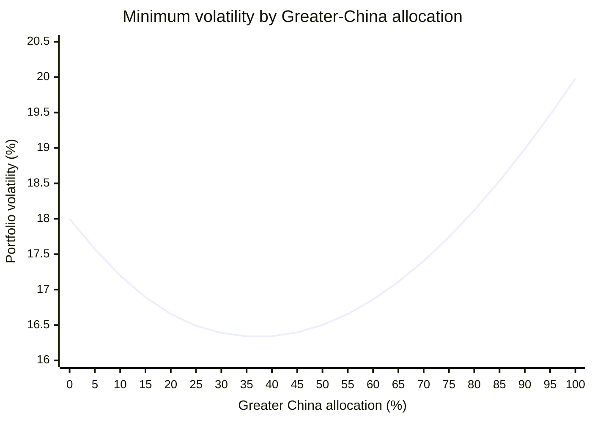
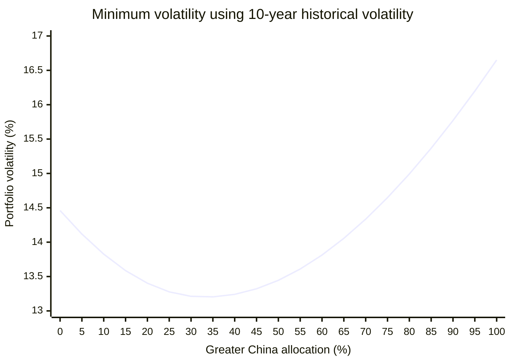

# Equity allocation across three markets

This note estimates long-only allocations within the **equity sleeve** across:

- A-shares, represented by the CSI 800;
- Hong Kong-listed stocks, represented by the Hang Seng Index; and
- U.S. large-cap stocks, represented by the S&P 500.

The stock/bond decision comes first. All weights below sum to 100% of stocks, not the total portfolio.

_Last updated: 2026. Assumptions are uncertain and implementation costs, taxes, fund access, and regulations may change._

**Not financial advice.** This is a planning framework, not a personal recommendation.

## Summary

The optimizer does not identify one reliable exact allocation. Depending on reasonable inputs, the results range from roughly:

- 29%-49% A-shares;
- 0%-30% Hong Kong-listed stocks; and
- 40%-67% U.S. stocks.

The most stable conclusions are:

1. U.S. stocks receive the largest weight in most cases because of their lower assumed volatility and diversification benefit.
2. Hong Kong receives the least stable weight. Historical volatility and implementation costs generally reduce its allocation, which reaches zero in the constant-return net-of-cost cases.
3. Equal expected returns make maximum proxy Sharpe equivalent to minimum variance.
4. Estimated returns, fees, and volatility materially change the result. Optimized weights should therefore be rounded and treated as evidence, not precise targets.

The existing **18/12/70** allocation remains a simple policy benchmark with a stronger U.S. tilt than every reported optimized case. The optimization supports **30/5/65** for minimum volatility, approximately **40/10/50** for a Sharpe-focused allocation, and **35/5/60** as a compromise across both objectives. None is uniquely optimal.

## Inputs

### Returns and volatility

| Asset class             | Base expected return | Assumed volatility | 10-year historical volatility |
| ----------------------- | -------------------: | -----------------: | ----------------------------: |
| A-shares                |                 7.5% |                22% |                        17.86% |
| Hong Kong-listed stocks |                 8.0% |                22% |                        18.90% |
| U.S. large-cap stocks   |                 6.5% |                18% |                        14.46% |

### Correlations

| Asset class             | A-shares | Hong Kong | U.S. stocks |
| ----------------------- | -------: | --------: | ----------: |
| A-shares                |     1.00 |      0.65 |        0.40 |
| Hong Kong-listed stocks |     0.65 |      1.00 |        0.55 |
| U.S. large-cap stocks   |     0.40 |      0.55 |        1.00 |

### Fees and withholding tax

| Asset class             | Gross base return | Fund fee | Est. withholding tax | Net base return | Net return from 7% common return |
| ----------------------- | ----------------: | -------: | -------------------: | --------------: | -------------------------------: |
| A-shares                |             7.50% |    0.29% |                0.00% |           7.21% |                            6.71% |
| Hong Kong-listed stocks |             8.00% |    0.61% |                0.62% |           6.77% |                            5.77% |
| U.S. large-cap stocks   |             6.50% |    0.68% |                0.11% |           5.71% |                            6.21% |

## Method

Constraints for every optimization:

- fully invested: weights sum to 100%;
- long-only: every weight is between 0% and 100%.

Portfolio volatility is:

$$
\sigma_p = \sqrt{\mathbf{w}^{\mathsf T}\Sigma\mathbf{w}}
$$

The minimum-volatility portfolio solves:

$$
\min_{\mathbf{w}}\; \mathbf{w}^{\mathsf T}\Sigma\mathbf{w}
$$

The maximum-proxy-Sharpe portfolio uses a 2% risk-free rate and solves:

$$
\max_{\mathbf{w}}\; \frac{\mathbf{w}^{\mathsf T}\boldsymbol{\mu} - 2\%}{\sqrt{\mathbf{w}^{\mathsf T}\Sigma\mathbf{w}}}
$$

The planning returns are compound-return assumptions. Strictly, Sharpe optimization requires expected arithmetic returns. The reported values are therefore proxy Sharpe ratios, reinforcing the need to avoid false precision.

## Minimum-volatility results

Expected returns do not enter a pure minimum-volatility optimization. Changing return assumptions alone cannot change these weights.

| Volatility case               | A-shares | Hong Kong | U.S. stocks | Portfolio volatility |
| ----------------------------- | -------: | --------: | ----------: | -------------------: |
| Base assumed volatility       |   29.63% |     7.64% |      62.73% |               16.33% |
| 10-year historical volatility |   32.52% |     0.72% |      66.76% |               13.20% |

The historical-volatility case nearly eliminates Hong Kong because it has the highest volatility and the highest correlation with U.S. stocks. The lower modeled portfolio volatility should not be read as a forecast; it largely reflects the lower historical inputs.

### Greater-China allocation and volatility

The following figure uses the base volatility and correlation assumptions. At each Greater-China weight, the A-share/Hong Kong split is chosen to minimize volatility; U.S. stocks receive the remaining weight.

The global minimum occurs at **37.27% Greater China**, divided into 29.63% A-shares and 7.64% Hong Kong, with 62.73% in U.S. stocks. Modeled volatility is 16.33%.

At **30% Greater China**, the conditional minimum is 27.27% A-shares, 2.73% Hong Kong, and 70% U.S. stocks, producing 16.39% volatility. The existing 18/12/70 policy allocation also has 30% Greater China but produces slightly higher modeled volatility of 16.48% because its Hong Kong weight is higher. The 0.09-percentage-point difference is economically small relative to estimation uncertainty.

### Greater-China allocation using 10-year historical volatility

This figure replaces the base volatility assumptions with the 10-year historical volatilities. It retains the planning correlations and again minimizes volatility over the A-share/Hong Kong split at each Greater-China weight.

The global minimum occurs at **33.24% Greater China**, divided into 32.52% A-shares and 0.72% Hong Kong, with 66.76% in U.S. stocks. Modeled volatility is 13.20%.

At **30% Greater China**, the conditional minimum is 30% A-shares, 0% Hong Kong, and 70% U.S. stocks, producing 13.21% volatility. The existing 18/12/70 policy allocation produces 13.37%. This 0.16-percentage-point difference remains small relative to estimation uncertainty.

## Maximum proxy-Sharpe results

### Base volatility

| Return case                     | A-shares | Hong Kong | U.S. stocks | Portfolio return | Portfolio volatility | Proxy Sharpe ratio |
| ------------------------------- | -------: | --------: | ----------: | ---------------: | -------------------: | -----------------: |
| Base expected returns           |   28.62% |    30.23% |      41.14% |            7.24% |               16.87% |              0.311 |
| Base returns minus fees and tax |   45.12% |    14.66% |      40.22% |            6.54% |               16.92% |              0.269 |
| Constant 7% returns             |   29.63% |     7.64% |      62.73% |            7.00% |               16.33% |              0.306 |
| Constant 7% minus fees and tax  |   39.95% |     0.00% |      60.05% |            6.41% |               16.43% |              0.268 |

The base-return case gives Hong Kong a large weight because it combines the highest assumed gross return with imperfect correlation. This result disappears when returns are equalized or costs are deducted. It is therefore especially sensitive to uncertain inputs.

### Alternative: 10-year historical volatility

This sensitivity test reruns every return case with historical volatilities while retaining the planning correlation matrix.

| Return case                     | A-shares | Hong Kong | U.S. stocks | Portfolio return | Portfolio volatility | Proxy Sharpe ratio |
| ------------------------------- | -------: | --------: | ----------: | ---------------: | -------------------: | -----------------: |
| Base expected returns           |   32.74% |    20.92% |      46.34% |            7.14% |               13.61% |              0.378 |
| Base returns minus fees and tax |   48.63% |     6.65% |      44.72% |            6.51% |               13.67% |              0.330 |
| Constant 7% returns             |   32.52% |     0.72% |      66.76% |            7.00% |               13.20% |              0.379 |
| Constant 7% minus fees and tax  |   39.10% |     0.00% |      60.90% |            6.41% |               13.25% |              0.333 |

Historical volatility generally raises A-share and U.S. weights while reducing Hong Kong. The proxy Sharpe ratios are higher mainly because all three historical volatilities are below the conservative planning assumptions, not because the portfolios are necessarily better.
