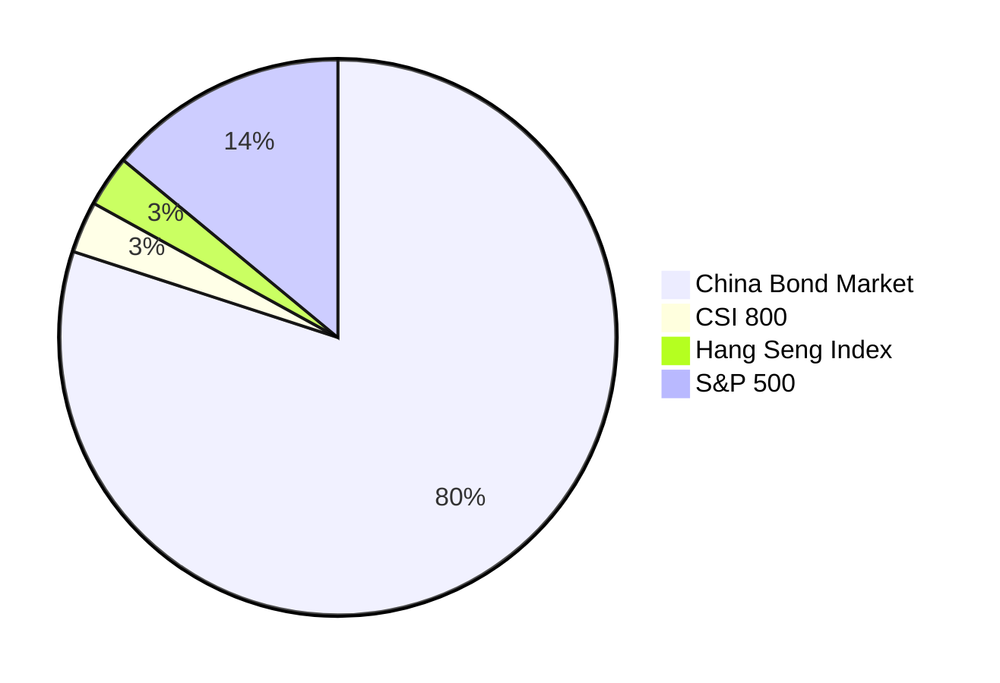
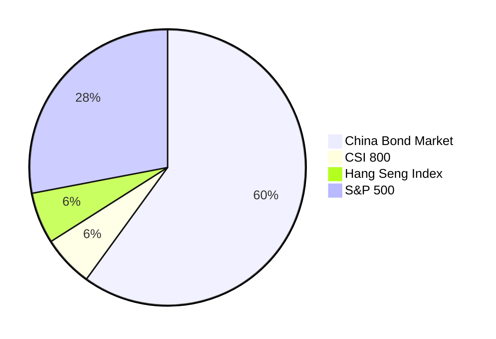
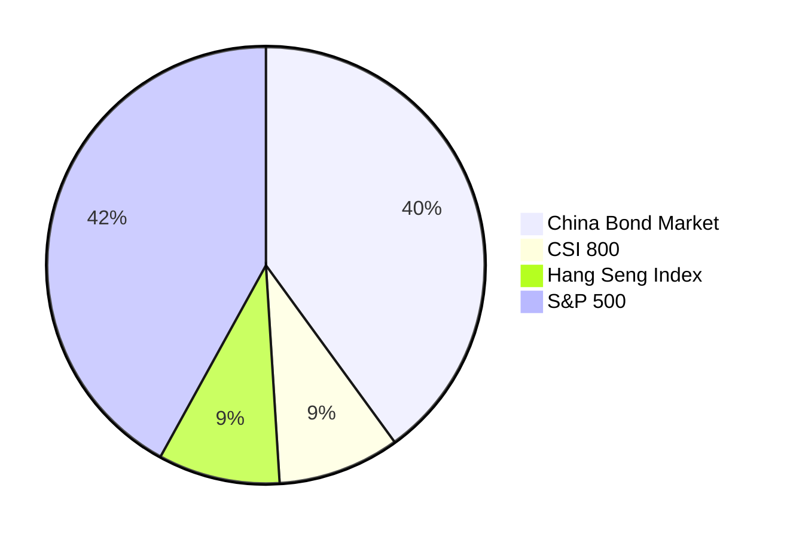
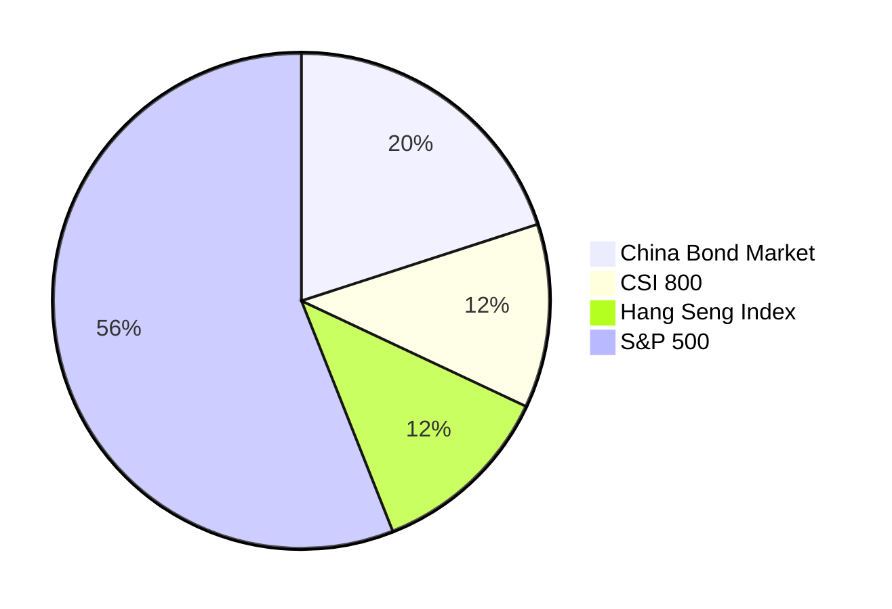
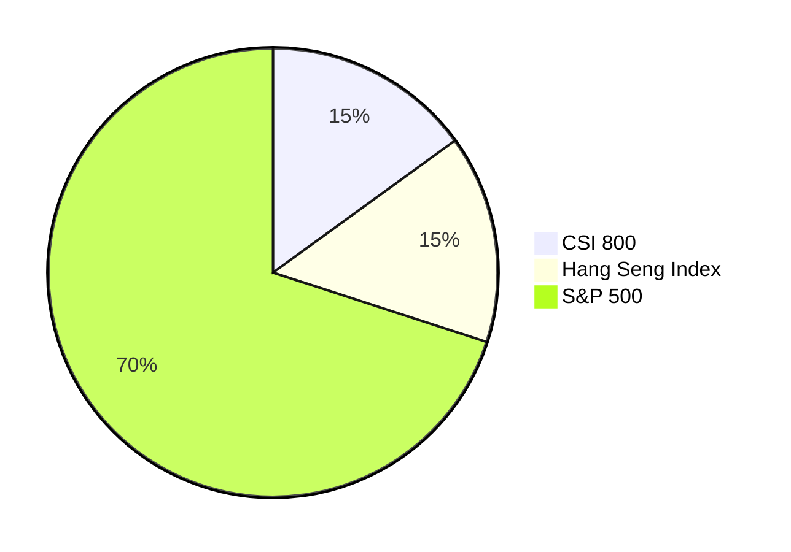

# Chinese Couch Potato Investing

In Canada, [Canadian Couch Potato](https://canadiancouchpotato.com/) offers great guidance for low-cost, passive, index investing. This note introduces example "couch potato" portfolios for Chinese investors.

PLEASE NOTE: THIS DOCUMENT IS NOT FINANCIAL ADVICE. INDIVIDUAL SITUATIONS VARY. USE AT YOUR OWN RISK.

**For the average person, a well-diversified, low-cost, broad-market-indexed, strictly passive investment portfolio consisting of bonds and stocks is the best place to invest money.**

Key takeaways:

- Periodic contributions and buy-and-hold strategies help overcome behavioural biases that often lead to suboptimal outcomes.

- Prevailing evidence shows that actively managed funds typically _underperform_ the market after adjusting for fees.

- Factor premiums, discovered through backtesting, have historically existed. However, its persistency is uncertain. It wouldn't be meaningful for the average person to take a bet at the price of deviating from the cap-weighted version and incurring higher fees.

- Market timing, a common investment pitfall, is one of the worst habits investors tend to fall into.

- Day trading and cryptocurrency, while frequently promoted on social media, are more akin to gambling in casinos than legitimate investment strategies - they're not good investments.

- Unfortunately, if not "day trading," many investors invest in individual stocks or sector funds, driven by market sentiment. This approach often leads to below-market returns.

## Available Asset Classes

The meaningful and accessible asset classes for investors in mainland China, available as mutual funds (公募基金) or ETFs[^1], are as follows:

- Domestic Bonds
  - Various segments available, including government, investment grade, high-yield and convertible.
- A Shares (Shanghai & Shenzhen Stock Exchanges)
  - CSI 300 index (沪深 300 指数), a large-cap index.
  - CSI 800 index (中证 800 指数), large and mid caps.
- Hong Kong-listed Stocks
  - Hang Seng Index (恒生指数), a large-cap index for stocks listed in the Hong Kong Stock Exchange representing 60% capitalization.
  - Hang Seng China Enterprises Index (恒生中国企业指数), comprises companies with close business ties to mainland China.
- U.S. Large Stocks
  - Nasdaq 100 and S&P 500 are available as QDII funds.
- Other international markets (e.g., Europe, Japan) are available but with limited options and high fees.

## Capital Market Assumptions

### Return and Volatility Assumptions

| Asset class       | Expected return (author's estimate) | Annualized Volatility (10-y historical) |
| ----------------- | ----------------------------------: | --------------------------------------: |
| China Bond Market |                                  3% |                                   1.79% |
| A Shares          |                                  8% |                                  21.76% |
| HK-listed Stocks  |                                  8% |                                  19.30% |
| U.S. Large Stocks |                                  8% |                                  14.46% |

Note:

1. Expected returns above are compound, nominal, before taxes and fees.
2. 10-y historical volatilities are from:
   - China Bond Market: Factsheet for S&P China Bond Index
   - China A Shares: Factsheet for MSCI China A Onshore Index
   - HK-listed Stocks: Factsheet for MSCI Hong Kong-listed Southbound Index
   - U.S. Large Stocks: Factsheet for S&P 500 (in CNY)

### Correlations

| Asset Class       | A Shares | HK-listed Stocks | U.S. Large Stocks |
| ----------------- | -------: | ---------------: | ----------------: |
| A Shares          |        1 |             0.68 |              0.44 |
| HK-listed Stocks  |     0.68 |                1 |              0.49 |
| U.S. Large Stocks |     0.44 |             0.49 |                 1 |

Note:

1. Correlations are author's estimates.
2. Bonds are excluded, assuming 0 correlation with stocks.

## Representative Funds

The following low-cost index funds that are available for investors are selected to represent these four asset classes.

| Asset Class             | Mutual Fund Example (场外基金示例) | Ticker | Management Fee (运作费率) | Foreign Withholding Tax (分红税) | MER + FWT |
| ----------------------- | ---------------------------------- | ------ | ------------------------- | -------------------------------- | --------- |
| China Bond Market       | 易方达中债新综指 A                 | 161119 | 0.20%                     | -                                | 0.20%     |
| A Shares                | 易方达中证 800ETF                  | 007856 | 0.29%                     | -                                | 0.29%     |
| Hong Kong-listed Stocks | 华夏沪港通恒生 ETF                 | 000948 | 0.61%                     | 3.1% \* 24% = 0.74%              | 1.35%     |
| U.S. Large Stocks       | 摩根标普 500 指数                  | 017641 | 0.68%                     | 1.1% \* 30% = 0.33%              | 1.01%     |

Note:

1. These are examples; many alternatives exist.

## Constructing Model Portfolios

The model portfolios are derived from running portfolio optimization (maximum Sharpe, minimum variance), with some subjective adjustments.

Allocating a portion to international stocks, especially U.S. equities, is crucial for diversification and volatility reduction.

Those who invest solely in A Shares (or A+H Shares) tend to experience poorer risk-adjusted returns — A standard deviation of 20% is very high for most people. A portfolio consisting just a few A-Share stocks typically has volatility a lot more than 20%, with the expected return being the same.

Like investors in other markets, Chinese investors should consider an optimal home bias. Allocating between 50-90% of the equity portion to international equities is desirable. The model portfolios suggest a 15/15/70 split for Shanghai & Shenzhen/HK/US, which serves as a good starting point.

### Asset selection considerations

#### Other international markets

Ideally, diversifying into other international markets (e.g., Europe, Japan) is beneficial. Unfortunately, as of now the available QDII funds for Chinese investors are limited, and the fees are too stiff and may outweigh the benefits. If more options become available in the future, it would be worth considering adding them to the portfolio, to reduce over-concentration in the U.S. market. One particular fund I noted is 006282 摩根欧洲指数, which tracks the MSCI Europe Index.

#### Gold

I did not include Gold in the model portfolios. IMO, the volatility of gold price is high, it's generally better to hold bonds than gold. Nevertheless, it might make sense to allocate a small portion (up to 10%) in replacement of bonds for those who are looking for further diversification.

#### Commodities

Similar to gold, the volatility is high and the expected return is low. Lack of good index funds is another reason for not including commodities in the model portfolios.

#### REITs

I don't consider REITs as a separate asset class. Private real estate behaves differently from publicly traded REITs. The latter is more correlated with stocks than bonds. Therefore, I don't recommend allocating to REITs in a market-cap-weighted portfolio.

#### Style-tilt / factor investing

I don't recommend tilting towards quality, value, or any other factors. The evidence is mixed on whether factor premiums will persist in the future. For the average investor, it's better to stick with market-cap-weighted index funds. It's better to add bonds to reduce volatility than to tilt towards certain factors like dividend (红利), low-vol (低波动).

Sector-tilt is also not recommended. Choosing Nasdaq 100 over S&P 500 is a bet on the tech sector, a textbook example of performance chasing & recency bias.

## Final Results

### 20% Stocks/80% Bonds "Income"

```mermaid
pie
"China Bond Market" : 80
"CSI 800": 3
"Hang Seng Index" : 3
"S&P 500" : 14
```

### 40% Stocks/60% Bonds "Conservative"

```mermaid
pie
"China Bond Market" : 60
"CSI 800" : 6
"Hang Seng Index" : 6
"S&P 500" : 28
```

### 60% Stocks/40% Bonds "Balanced"

```mermaid
pie
"China Bond Market" : 40
"CSI 800" : 9
"Hang Seng Index" : 9
"S&P 500" : 42
```

### 80% Stocks/20% Bonds "Growth"

```mermaid
pie
"China Bond Market" : 20
"CSI 800" : 12
"Hang Seng Index" : 12
"S&P 500" : 56
```

### 100% Stocks "Aggressive"

```mermaid
pie
"CSI 800" : 15
"Hang Seng Index" : 15
"S&P 500" : 70
```

[^1]: Bank term deposits (定期存款) and direct real estate investing (投资房) are "meaningful" options but they are not available as mutual funds or ETFs. Another option is banks' wealth management products (理财产品); they're not as transparent as mutual funds (公募基金) mentioned in the note. I wouldn't recommend any of these: privately offered funds (私募基金), segregated funds (储蓄型/投资型保险), nor private equities (私募股权/信托).
