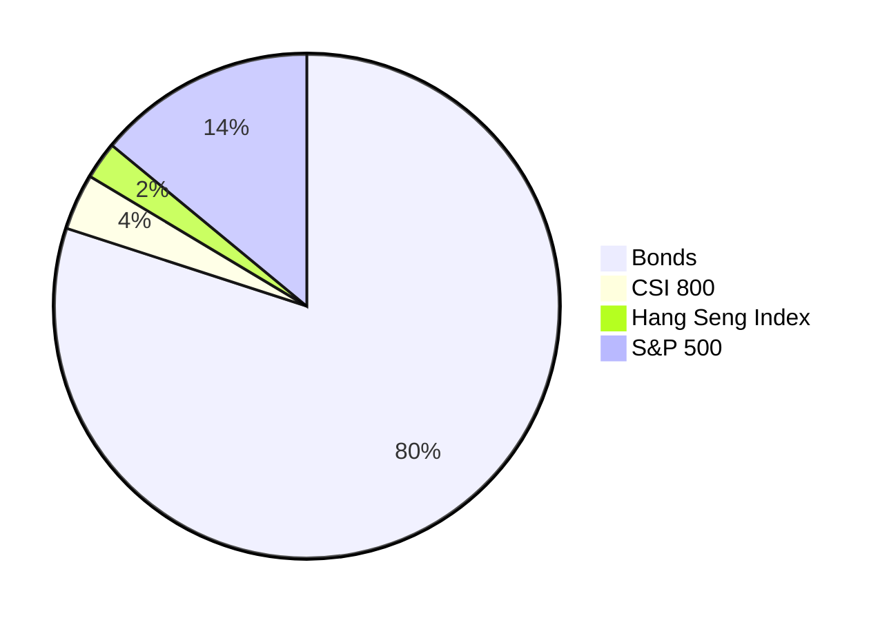
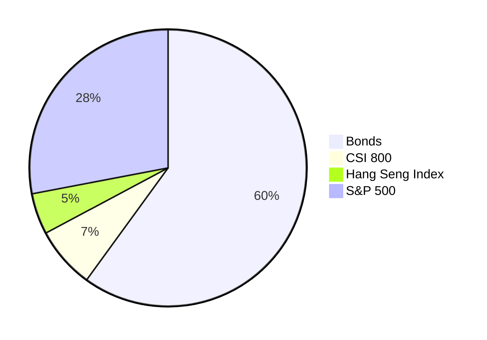
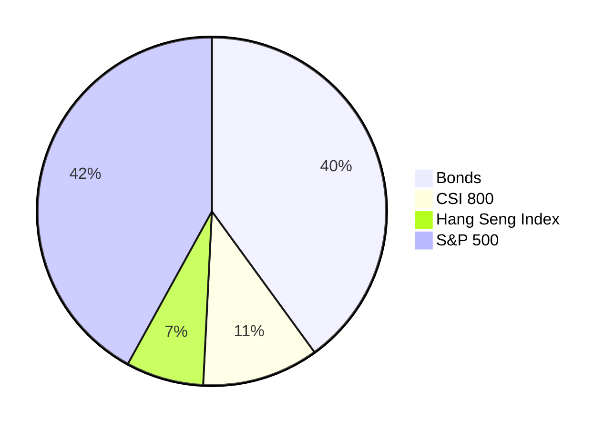
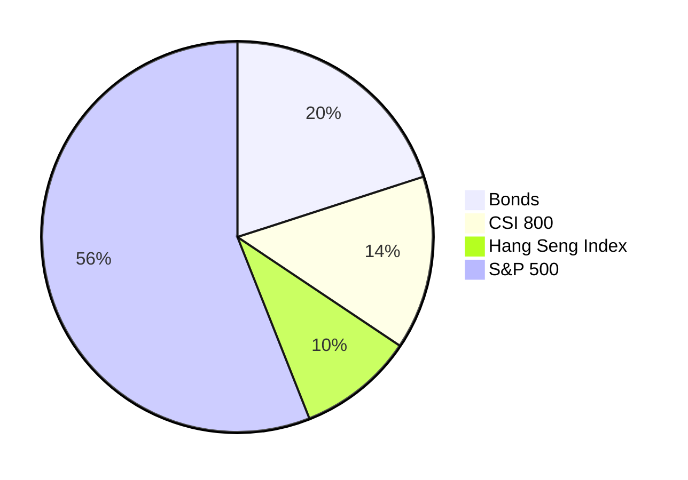
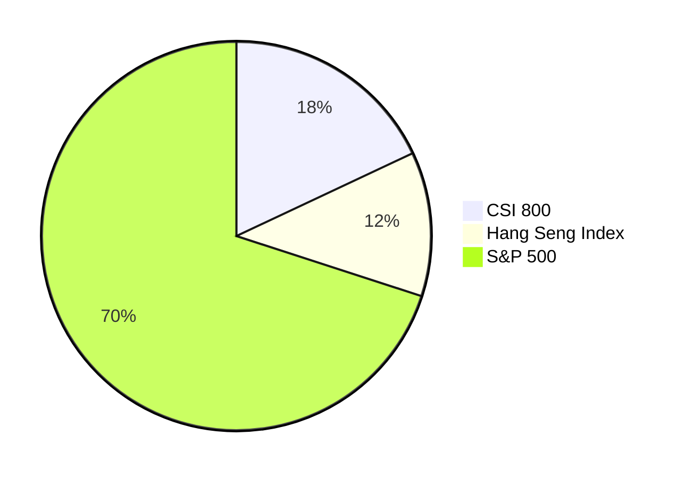

# Chinese Couch Potato investing

Canada's [Canadian Couch Potato](https://canadiancouchpotato.com/) is a useful guide to low-cost, passive index investing. This note adapts that approach for investors in mainland China through a set of example "couch potato" portfolios.

_Last updated: 2026. Fund fees, returns, tax rates, and rules change over time — check the current numbers before you act._

**Not financial advice.** This note reflects my personal views and is intended for general education. It is not a personal recommendation. Fund details, tax rules, and individual circumstances vary, and the estimates in this note may be wrong. Do your own research and consider consulting a licensed adviser before investing.

**For most people, a simple, passively managed mix of low-cost, broad stock and bond index funds is a sensible place to start.**

Key takeaways:

- Invest a fixed amount regularly and hold for the long term. This reduces the temptation to react to market news.

- After fees, most active funds _underperform_ the market.

- Factor tilts, such as value, have worked in the past but may not continue to do so. For most people, they are not worth the added cost and complexity.

- Avoid trying to time the market. It is one of the most damaging habits investors can develop.

- Day trading and crypto are closer to speculation than long-term investing and are excluded from this approach.

- Picking individual stocks or popular sectors also tends to underperform the broader market.

## Available asset classes

Investors in mainland China can access these asset classes through mutual funds and ETFs:

- Domestic bonds: Prefer policy-bank bonds (政策性金融债) and central government bonds (国债) over corporate bonds.
- A-shares: Prefer the CSI 800 Index (中证 800 指数), which covers large- and mid-cap stocks.
  - Alternative: CSI 300 Index (沪深 300 指数), which covers large-cap stocks only.
- Hong Kong-listed stocks: Prefer the Hang Seng Index (恒生指数), a broad large-cap index representing about 60% of the Hong Kong stock market by capitalization.
  - Alternative: Hang Seng China Enterprises Index (恒生中国企业指数), which focuses on companies closely tied to mainland China.
- U.S. large-cap stocks: Prefer the S&P 500, available through QDII funds.
  - Alternative: Nasdaq-100.
- Other international markets, such as Europe and Japan, are accessible but offer fewer options and generally charge higher fees.

## Capital market assumptions

### Returns and volatilities

| Asset class           | Expected return | Historical volatility (10-year) | Assumed volatility |
| --------------------- | --------------: | ------------------------------: | -----------------: |
| Bonds                 |              3% |                           1.69% |                 3% |
| A-shares              |            7.5% |                          17.86% |                22% |
| HK-listed stocks      |              8% |                          18.90% |                22% |
| U.S. large-cap stocks |            6.5% |                          14.46% |                18% |

Notes:

1. The expected returns above are compound nominal returns before taxes and fees.
2. Historical volatilities come from the factsheets listed below.
   - Bonds: Factsheet for S&P China Bond Index
   - A-shares: Factsheet for MSCI China A Onshore Index
   - HK-listed stocks: Factsheet for MSCI Hong Kong-listed Southbound Index
   - U.S. large-cap stocks: Factsheet for S&P 500
3. Assumed volatilities are conservative estimates used for long-term planning rather than forecasts. Foreign-stock assumptions reflect the perspective of an unhedged CNY investor and therefore include currency risk.

### Correlations

| Asset class           | Bonds | A-shares | HK-listed stocks | U.S. large-cap stocks |
| --------------------- | ----: | -------: | ---------------: | --------------------: |
| Bonds                 |  1.00 |     0.00 |             0.00 |                  0.00 |
| A-shares              |  0.00 |     1.00 |             0.65 |                  0.40 |
| HK-listed stocks      |  0.00 |     0.65 |             1.00 |                  0.55 |
| U.S. large-cap stocks |  0.00 |     0.40 |             0.55 |                  1.00 |

1. These long-term planning assumptions, not forecasts. Actual correlations may rise during periods of market stress.

## Representative funds

The following funds are representative examples of low-cost index products available to investors.

| Asset class             | Mutual fund example (基金示例) | Ticker          | Management expense ratio (运作费率) | Est. foreign withholding tax (分红税) |
| ----------------------- | ------------------------------ | --------------- | ----------------------------------- | ------------------------------------- |
| Bonds                   | 政策性金融债                   | 511520 场内     | 0.20%                               | -                                     |
| A-shares                | 易方达中证 800ETF              | 007856 场内     | 0.29%                               | -                                     |
| Hong Kong-listed stocks | 华夏沪港通恒生 ETF             | 513660 场内     | 0.61%                               | 3.1% × 24% = 0.74%                    |
| U.S. large-cap stocks   | 摩根标普 500 指数              | 017641 **场外** | 0.68%                               | 1.1% × 10% = 0.11%                    |

Notes:

1. These funds are examples, not recommendations. Check each fund's current fees before investing. For the bond allocation, term deposits (定期存款) are another simple, low-risk option with no fund management fee.
2. Foreign withholding tax = dividend yield × tax rate, a yearly drag on returns.

## Methodology

These portfolios begin with minimum-volatility analysis and are then adjusted manually to account for practical diversification considerations.

Holding international stocks, particularly U.S. stocks, can improve diversification and reduce overall volatility.

An all-A-share portfolio, or even an A-share and H-share portfolio, has worse expected risk-adjusted returns under these assumptions. A standard deviation of 20% is already high, and a concentrated portfolio of individual A-shares can fluctuate even more without offering a higher expected return.

As with investors in other countries, mainland Chinese investors should be cautious about home bias. These portfolios place 70% of the equity sleeve outside Greater China, using an 18/12/70 split across Shanghai and Shenzhen, Hong Kong, and the U.S.

Rebalance to your target allocation on a schedule, such as once a year, or whenever an asset class drifts by more than about five percentage points. The important part is to choose a rule and apply it consistently. Rebalancing encourages buying low and selling high without relying on market timing.

### Asset-selection considerations

#### Other international markets

Europe and Japan are not included because suitable low-cost index funds remain limited. Future versions may include them if better options become available.

#### Gold

Gold is excluded because it produces no income, has delivered roughly flat long-run real returns, and can be almost as volatile as stocks. Bonds generally provide more reliable portfolio stability while producing income. A small allocation of up to 10% in place of bonds may still be reasonable for investors who want additional diversification.

#### Commodities

Commodities share many of gold's drawbacks: high volatility, low expected returns, and limited access through suitable index funds. They are therefore excluded.

#### REITs

This note does not treat REITs as a separate asset class. Listed REITs behave more like stocks than bonds and differ from direct property ownership, so they add limited diversification to a market-cap-weighted equity portfolio. They are therefore excluded.

#### Style and factor tilts

Avoid tilting toward quality, value, dividends (红利), low volatility (低波动), or other factors. Their future premiums are uncertain, and the funds generally cost more. To reduce risk, add bonds rather than relying on a factor tilt. For the equity sleeve, use broad, market-cap-weighted index funds.

Avoid sector tilts as well. Choosing the Nasdaq-100 over the S&P 500 is largely a bet on technology and may amount to performance chasing.

## Model portfolios

### 20% stocks/80% bonds "Conservative"

```mermaid
pie
"Bonds" : 80
"CSI 800": 3.6
"Hang Seng Index" : 2.4
"S&P 500" : 14
```

### 40% stocks/60% bonds "Moderate"

```mermaid
pie
"Bonds" : 60
"CSI 800" : 7.2
"Hang Seng Index" : 4.8
"S&P 500" : 28
```

### 60% stocks/40% bonds "Balanced"

```mermaid
pie
"Bonds" : 40
"CSI 800" : 10.8
"Hang Seng Index" : 7.2
"S&P 500" : 42
```

### 80% stocks/20% bonds "Growth"

```mermaid
pie
"Bonds" : 20
"CSI 800" : 14.4
"Hang Seng Index" : 9.6
"S&P 500" : 56
```

### 100% stocks "Aggressive"

```mermaid
pie
"CSI 800" : 18
"Hang Seng Index" : 12
"S&P 500" : 70
```

## Practical guide

### Which one should you pick?

More stocks mean higher expected long-run returns, but also larger fluctuations and potential losses. Choose an allocation that fits your circumstances and your ability to tolerate those losses, then follow it consistently.

### How to get started

1. Open an account at a broker or fund platform (券商 or 基金 app).
2. Pick a stock/bond split from above.
3. Buy the matching funds in those proportions.
4. Set up automatic monthly contributions (定投) to make investing consistent.
5. Rebalance to your target allocation once a year. Otherwise, leave the portfolio alone.

The hardest part is not choosing the funds; it is avoiding panic-selling when markets fall. Rebalance according to your chosen rule and otherwise remain invested through market downturns.

### Other investment vehicles

The following table summarizes other investment and savings vehicles that fall outside the model portfolios:

| Vehicle           | Recommendation       | Why                                                                        |
| ----------------- | -------------------- | -------------------------------------------------------------------------- |
| 定期存款          | ✅ Good for bonds    | Near-zero risk, no fund fee, simple. A fine substitute for the bond slice. |
| 货币基金          | ✅ Good for cash     | For emergency cash and parking, not a portfolio asset.                     |
| 理财产品          | ⚠️ Caution           | Less transparent than 公募基金 and often heavily promoted by bank staff.   |
| 投资房            | ➖ Separate decision | Large, illiquid, concentrated. Outside the scope of this note.             |
| 私募基金          | ❌ Avoid             | High minimums, high fees, low transparency.                                |
| 储蓄型/投资型保险 | ❌ Avoid             | High cost, poor returns; mixes insurance with investing.                   |
| 私募股权/信托     | ❌ Avoid             | Illiquid, opaque, and higher risk than they appear.                        |
| 期货/期权         | ❌ Avoid             | Speculation, not investing — same bucket as day trading.                   |
