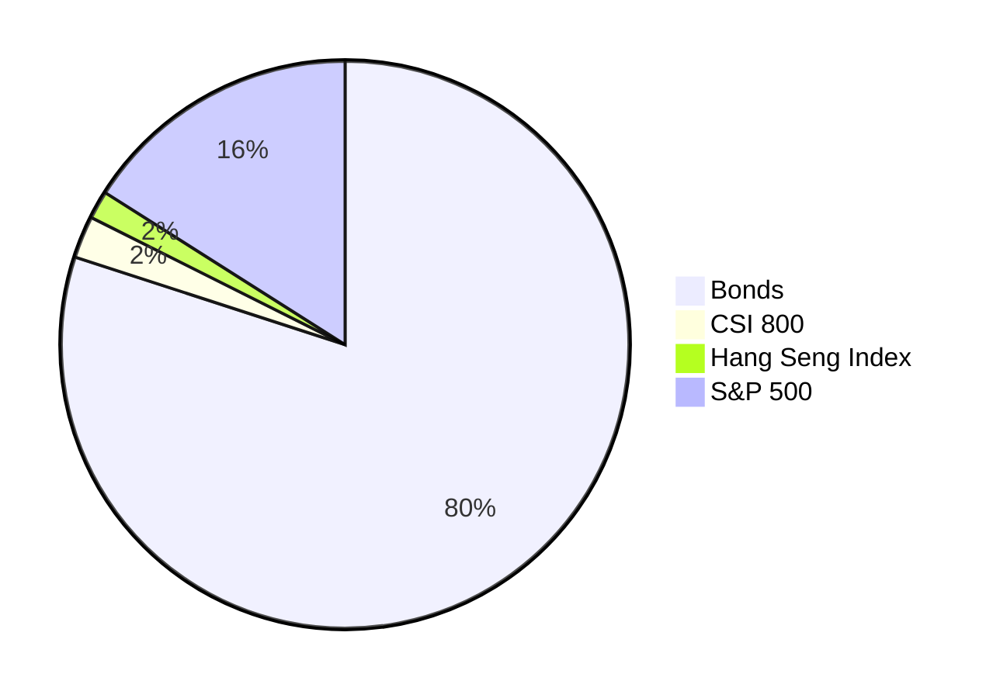
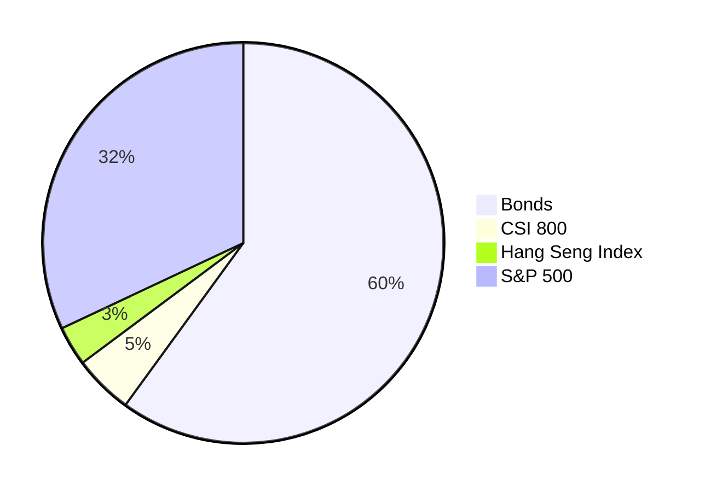
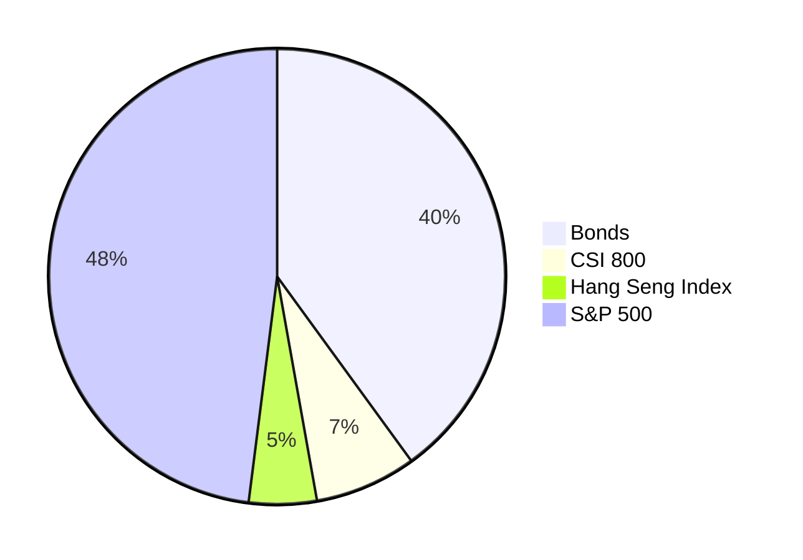
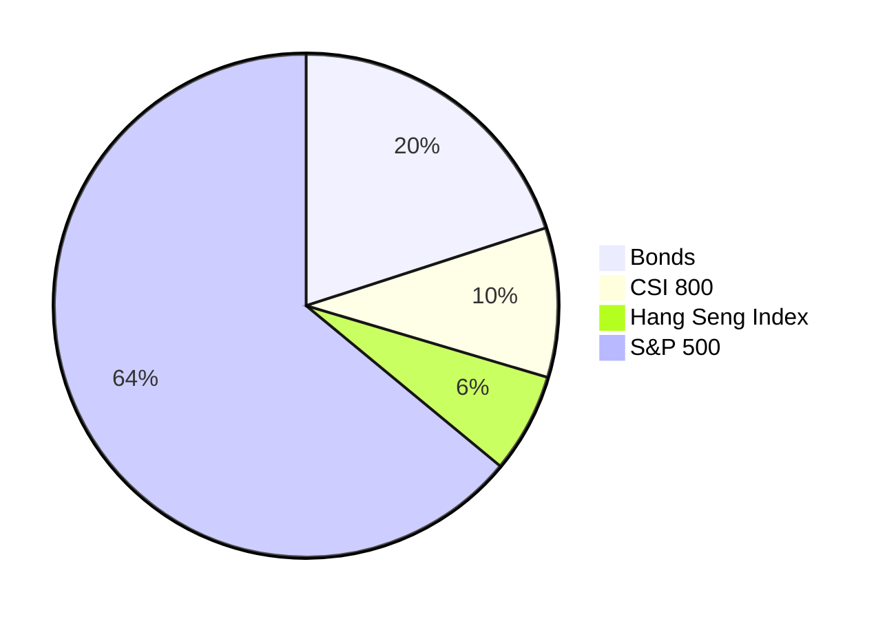
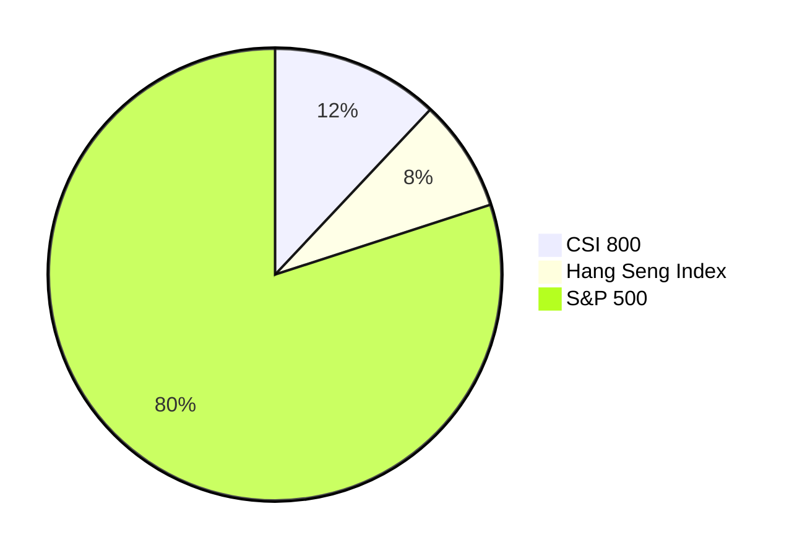

# Chinese Couch Potato Investing

Canada's [Canadian Couch Potato](https://canadiancouchpotato.com/) is a great guide to low-cost, passive index investing. This note adapts the idea into example "couch potato" portfolios for investors in mainland China.

**Not financial advice.** This is my personal opinion for general education, not a recommendation for you. Your situation is different, fund details and tax rules change over time, and all the numbers here are estimates that can be wrong. Do your own research and consider a licensed adviser before investing. You invest at your own risk.

**For most people, the best place to invest is a simple mix of low-cost, broad index funds — bonds and stocks — held passively.**

Key takeaways:

- Invest a fixed amount regularly and hold. This beats the urge to react to the news.

- After fees, most active funds _underperform_ the market.

- Factor tilts (value, etc.) have worked in the past, but may not keep working. Not worth the higher fees for most people.

- Don't try to time the market. It's one of the worst habits investors have.

- Day trading and crypto are closer to gambling than investing. Skip them.

- Picking individual stocks or hot sectors usually trails the market too.

## Available Asset Classes

The meaningful and accessible asset classes for investors in mainland China, available as off-exchange mutual funds (场外公募基金) or ETFs[^1], are as follows:

- Cash
  - Money market funds (货币基金, e.g. 余额宝) are for emergency cash and short-term parking — not a portfolio asset class. Keep these separate from your invested money.
- Domestic Bonds
  - Focus on short-duration, high-quality bonds: policy-bank bonds (政策性金融债) and central government bonds (国债). These carry very low credit and interest-rate risk.
- A Shares (Shanghai & Shenzhen Stock Exchanges)
  - CSI 800 index (中证 800 指数), large and mid caps.
  - CSI 300 index (沪深 300 指数), a large-cap-only alternative.
- Hong Kong-listed Stocks
  - Hang Seng Index (恒生指数), a large-cap index for stocks listed in the Hong Kong Stock Exchange representing 60% capitalization.
  - Hang Seng China Enterprises Index (恒生中国企业指数), comprises companies with close business ties to mainland China.
- U.S. Large Stocks
  - Nasdaq 100 and S&P 500 are available as QDII funds.
- Other international markets (e.g., Europe, Japan) are available but with limited options and high fees.

## Capital Market Assumptions

### Return and Volatility Assumptions

| Asset class       | Expected return (author's estimate) | Annualized Volatility (10-y historical) |
| ----------------- | ----------------------------------: | --------------------------------------: |
| Bonds             |                                  3% |                                   1.79% |
| A Shares          |                                  8% |                                  20.39% |
| HK-listed Stocks  |                                  8% |                                  21.32% |
| U.S. Large Stocks |                                  8% |                                  14.46% |

Note:

1. Expected returns above are compound, nominal, before taxes and fees.
2. I give all three stock markets the **same** 8% return on purpose, so the mix is decided by diversification, not by guessing which market wins.
3. 10-y volatilities are from the factsheets below. These indices don't exactly match the funds you'd hold (e.g. MSCI China A Onshore ≠ CSI 800), so real volatility will differ a bit:
   - Bonds: Factsheet for S&P China Bond Index (a broad index; a short-term policy-bank fund or term deposit will be even less volatile)
   - A Shares: Factsheet for MSCI China A Onshore Index
   - HK-listed Stocks: Factsheet for MSCI Hong Kong-listed Southbound Index
   - U.S. Large Stocks: Factsheet for S&P 500 (in CNY)

### Correlations

| Asset Class       | A Shares | HK-listed Stocks | U.S. Large Stocks |
| ----------------- | -------: | ---------------: | ----------------: |
| A Shares          |        1 |             0.65 |              0.37 |
| HK-listed Stocks  |     0.65 |                1 |              0.56 |
| U.S. Large Stocks |     0.37 |             0.56 |                 1 |

Note:

1. Correlations are author's calculation from MSCI data.
2. Bonds are left out.

## Representative Funds

The following low-cost index funds that are available for investors are selected as examples.

| Asset Class             | Mutual Fund Example (基金示例) | Ticker | Management Fee (运作费率) | Foreign Withholding Tax (分红税) | MER + FWT |
| ----------------------- | ------------------------------ | ------ | ------------------------- | -------------------------------- | --------- |
| Bonds                   | 短期政策性金融债基金           | TBD    | ~0.15%                    | -                                | ~0.20%    |
| A Shares                | 易方达中证 800ETF              | 007856 | 0.29%                     | -                                | 0.29%     |
| Hong Kong-listed Stocks | 华夏沪港通恒生 ETF             | 000948 | 0.61%                     | 3.1% \* ~24% = ~0.74%            | 1.35%     |
| U.S. Large Stocks       | 摩根标普 500 指数              | 017641 | 0.68%                     | 1.1% \* 10% = 0.11%              | 0.79%     |

Note:

1. These are just examples. The bond fund ticker is TBD — pick a low-fee one at your broker and check its fee. For bonds you can also just use term deposits (定期存款): low-risk, simple, no fund fee.
2. Foreign Withholding Tax = `dividend yield × tax rate`, a yearly drag on return.

## Constructing Model Portfolios

These start from the math that minimizes volatility, then I adjust by hand. They are **not** raw optimizer output: since all three stock markets share the same assumed return, the math alone would dump nearly everything into the U.S. and drop Hong Kong. The splits below pull that back to something sensible.

Holding some international stocks, especially U.S. ones, is key for diversification and lower volatility.

Going all-in on A-shares (or A+H) gives worse risk-adjusted returns. A 20% standard deviation is already high; a handful of A-share stocks swings even more, for no extra expected return.

Like investors everywhere, you should limit home bias. Put 70-90% of your stocks abroad. These portfolios use a 12/8/80 split across Shanghai & Shenzhen / HK / U.S. as a starting point.

The downside: with 80% of stocks in U.S. assets, most of your stock money is in U.S. dollars. Long term that's healthy diversification, but the CNY/USD swing adds ups and downs. Go in knowing this.

Rebalance back to your targets on a schedule — say once a year, or whenever a slice drifts more than ~5 points off. Any rule works; pick one and follow it. That's what makes you buy low and sell high without trying to time the market.

### Asset selection considerations

#### Personal pension account (个人养老金)

This is a tax-advantaged account, not an asset class. You can put in up to ¥12,000 a year and deduct it from taxable income, then hold pension funds (养老 FOF), index funds, or deposits inside. If you pay enough income tax for the deduction to matter, fill it first. The catch: the money is locked until retirement.

#### Other international markets

Adding Europe and Japan would help diversify away from the U.S. But for now the QDII funds are few and the fees too high to be worth it. If cheaper options appear, they'd be worth adding. One I've noted: 006282 摩根欧洲指数 (tracks MSCI Europe).

#### Gold

I left gold out. It pays no income, its long-run real return is about flat, and it swings almost like stocks. Bonds calm a portfolio better and pay you while they do it. Still, a small slice (up to 10%) in place of bonds is fine if you want extra diversification.

#### Commodities

Like gold: high volatility, low expected return. Good index funds are also scarce. Left out.

#### REITs

I don't treat REITs as a separate asset class. Listed REITs move more with stocks than with bonds (and differ from owning property directly), so they don't add much to a market-cap-weighted portfolio. Left out.

#### Style-tilt / factor investing

Don't tilt toward quality, value, dividend (红利), low-vol (低波动), or any factor. It's unclear these keep paying off, and they cost more. To lower risk, add bonds instead. Stick with plain market-cap-weighted index funds.

Don't tilt toward sectors either. Picking Nasdaq 100 over the S&P 500 is a bet on tech — classic performance chasing.

## Final Results

### 20% Stocks/80% Bonds "Income"

```mermaid
pie
"Bonds" : 80
"CSI 800": 2.4
"Hang Seng Index" : 1.6
"S&P 500" : 16
```

### 40% Stocks/60% Bonds "Conservative"

```mermaid
pie
"Bonds" : 60
"CSI 800" : 4.8
"Hang Seng Index" : 3.2
"S&P 500" : 32
```

### 60% Stocks/40% Bonds "Balanced"

```mermaid
pie
"Bonds" : 40
"CSI 800" : 7.2
"Hang Seng Index" : 4.8
"S&P 500" : 48
```

### 80% Stocks/20% Bonds "Growth"

```mermaid
pie
"Bonds" : 20
"CSI 800" : 9.6
"Hang Seng Index" : 6.4
"S&P 500" : 64
```

### 100% Stocks "Aggressive"

```mermaid
pie
"CSI 800" : 12
"Hang Seng Index" : 8
"S&P 500" : 80
```

[^1]: Other vehicles outside mutual funds and ETFs are rated in [Other Vehicles](#other-vehicles) below.

## Other Vehicles

Vehicles that are not mutual funds or ETFs, and how I rate them:

| Vehicle                                          | Recommendation       | Why                                                                        |
| ------------------------------------------------ | -------------------- | -------------------------------------------------------------------------- |
| Bank term deposits (定期存款)                    | ✅ Good for bonds    | Near-zero risk, no fund fee, simple. A fine substitute for the bond slice. |
| Money market funds (货币基金)                    | ✅ Good for cash     | For emergency cash and parking, not a portfolio asset.                     |
| Direct real estate (投资房)                      | ➖ Separate decision | Large, illiquid, concentrated. Outside the scope of this note.             |
| Wealth management products (理财产品)            | ⚠️ Caution           | Less transparent than mutual funds; holdings and risk are often unclear.   |
| Privately offered funds (私募基金)               | ❌ Avoid             | High minimums, high fees, low transparency.                                |
| Savings/investment insurance (储蓄型/投资型保险) | ❌ Avoid             | High cost, poor returns; mixes insurance with investing.                   |
| Private equity / trusts (私募股权/信托)          | ❌ Avoid             | Illiquid, opaque, and higher risk than they appear.                        |
| Futures / options (期货/期权)                    | ❌ Avoid             | Speculation, not investing — same bucket as day trading.                   |
