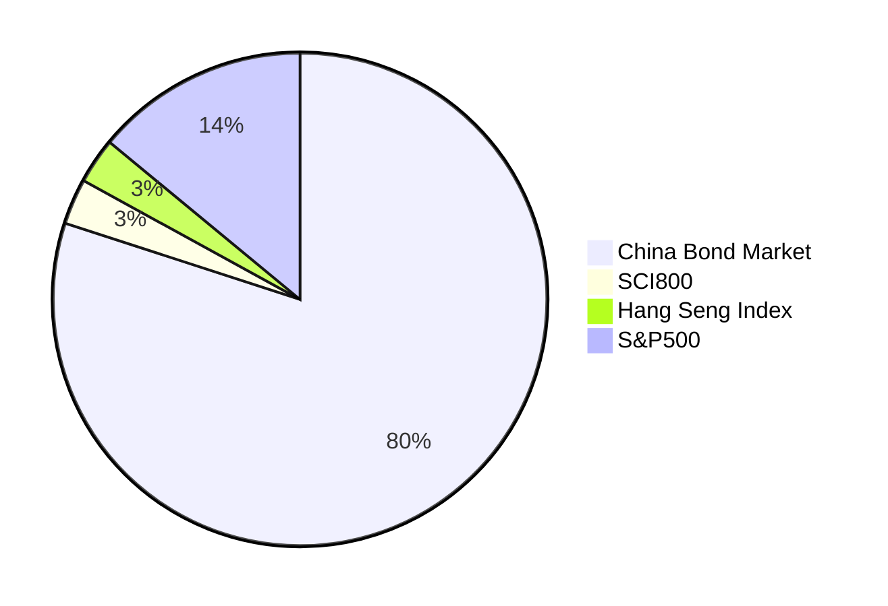
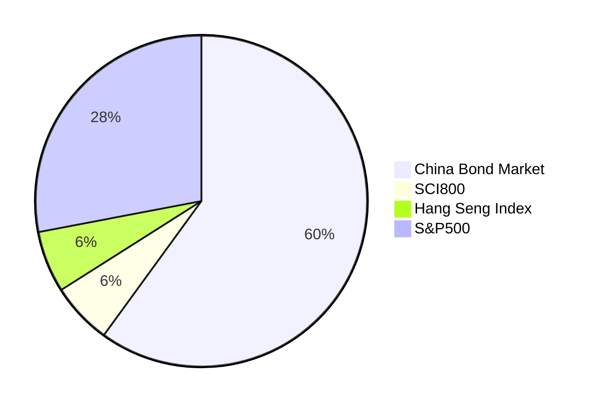
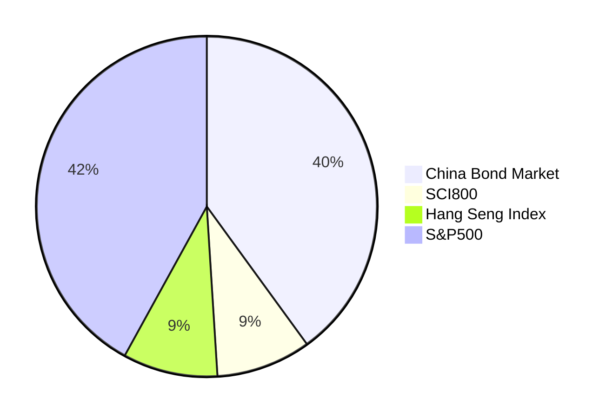
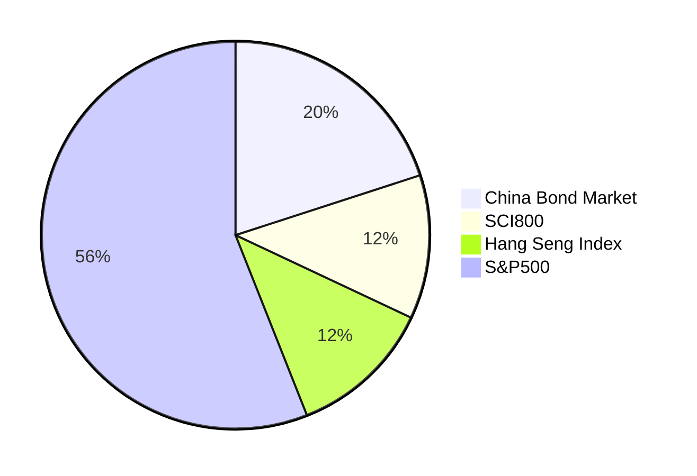

# Chinese Couch Potato Investing

In Canada, the Canadian Couch Potato offer great guidance for low-cost, passive, index investing. This note introduces example "couch potato" portfolios for Chinese investors.

IF YOU HAPPEN TO READ THIS - THIS NOTE IS ABSOLUTELY NOT FINANCIAL ADVICE. INDIVIDUAL SITUATIONS VARY. USE AT YOUR OWN RISK.

**For the average person, a low-cost, indexed, strictly passive, well-diversified portfolio consisting of bonds and stocks is the best way to invest money.**

Here are a few important points:

- Periodic contributions and buy-and-hold strategies help overcome behavioral biases that often lead to suboptimal outcomes.

- Prevailing evidence shows that actively managed funds typically _underperform_ the market after adjusting for fees.

- Factor returns, discovered through backtesting and data mining, have historically existed, however, emerging evidence indicates that these excess returns tend to _diminish_ following the discovery's publication; I doubt it would be meaningful for average person to take a bet on their persistency at a price of deviating from the cap-weighted version and higher fees.

- Market timing, a common investment pitfall, is one of the worst habits investors tend to fall into.

- While day trading and cryptocurrency, similar to gambling in casinos, open mentioned in social media, they're not good investments.

- Unfortunately, if not "day trading", many Chinese investors invest in individual stocks or sector funds, driven by market sentiment. This approach often leads to below-market returns.

## Available Asset Classes

The meaningful and accessible asset classes for investors in mainland China, available as mutual funds (公募基金) or ETFs[^1], are as follows:

- Domestic Bonds
  - Various segments available, including government, investment grade, high-yield and convertible.
- A Shares (Shanghai & Shenzhen Stock Exchanges)
  - SCI300 index (沪深 300), a large-cap index capturing 70% of capitalization.
  - SCI800 index (中证 800), large and mid caps accounting for 95% capitalization.
- Hong Kong-listed Stocks
  - Hang Seng Index (恒生指数), a large-cap index for stocks listed in the Hong Kong Stock Exchange representing 60% capitalization.
  - Hang Seng China Enterprises Index (恒生中国企业指数), comprises companies with close business ties to mainland China.
- U.S. Stocks
  - Nasdaq 100 and S&P500 are available as QDII funds.

## Capital Market Assumptions

### Return and Volatility Assumptions

| Asset Class       | Nominal Return | Volatility (Standard Deviation) |
| ----------------- | -------------: | ------------------------------: |
| China Bond Market |             3% |                           1.79% |
| A Shares          |             8% |                          21.76% |
| HK-listed Stocks  |             8% |                          19.30% |
| U.S. Stocks       |             8% |                          14.46% |

Note:

1. The returns are nominal, before taxes and fees.
2. Volatility sources are as follows:
   - China Bond Market: Factsheet for S&P China Bond Index
   - China A Shares: Factsheet for MSCI China A Onshore Index
   - HK-listed Stocks: Factsheet for MSCI Hong Kong-listed Southbound Index
   - U.S. Stocks: Factsheet for S&P500 (in CNY)

### Correlations

| Asset Class      | A Shares | HK-listed Stocks | U.S. Stocks |
| ---------------- | -------: | ---------------: | ----------: |
| A Shares         |        1 |             0.68 |        0.44 |
| HK-listed Stocks |     0.68 |                1 |        0.49 |
| U.S. Stocks      |     0.44 |             0.49 |           1 |

## Representative Funds

The following low-cost index funds that are available for investors in mainland China are selected to represent these four asset classes.

| Asset Class             | Fund Name          | Ticker |
| ----------------------- | ------------------ | ------ |
| China Bond Market       | 易方达中债新综指 A | 161119 |
| A Shares                | 易方达中证 800ETF  | 515810 |
| Hong Kong-Listed Stocks | 华夏沪港通恒生 ETF | 513660 |
| U.S. Stocks             | 摩根标普 500 指数  | 017641 |

Note:

1. These are examples; numerous alternatives exist.

## Model Portfolios

The model portfolios are derived from running Markowitz portfolio optimization, with some subjective adjustments.

Allocating a portion to international stocks, especially U.S. equities, is crucial for diversification and volatility reduction.

Those who invest solely in A Shares (or A+H Shares) tend to experience poorer risk-adjusted returns — A standard deviation of 20+% is scary!

Like investors in other markets, Chinese investors should consider an optimal home bias. Allocating between 50-90% of the equity portion to international stocks (U.S. equities) is desirable. The model portfolios suggest an 15/15/70 split for Shanghai & Shenzhen/HK/US, which serves as a good starting point.

### 20% Stocks/80% Bonds

### 40% Stocks/60% Bonds

### 60% Stocks/40% Bonds

### 80% Stocks/20% Bonds

[^1]: Bank deposits and direct real estate investing are "meaningful" options but they are not available as mutual funds or ETFs. Another option is banks' wealth management products (理财产品); they're not as transparent as mutual funds (公募基金) mentioned in the note. I wouldn't recommend private funds (私募基金) nor private equities (私募股权).
