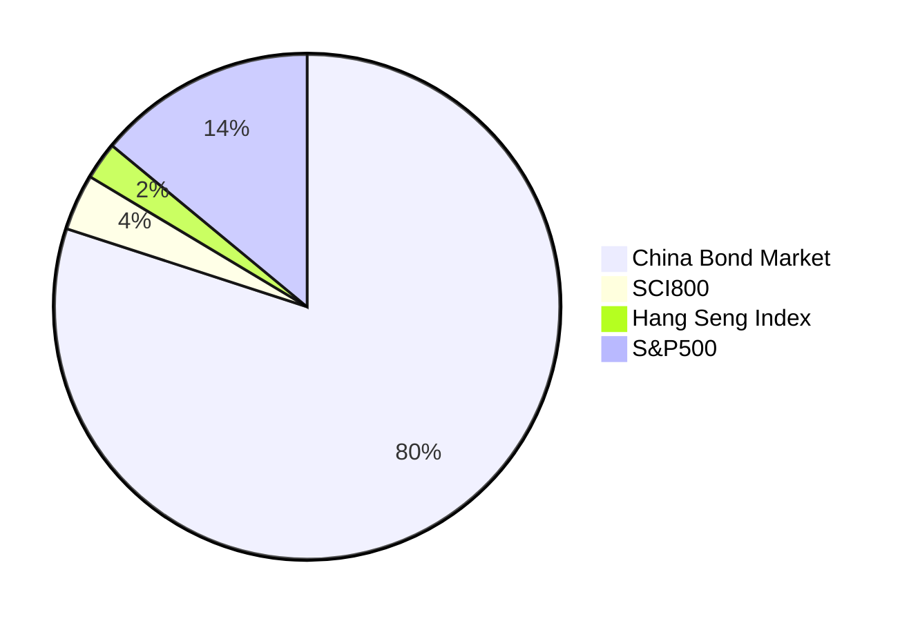
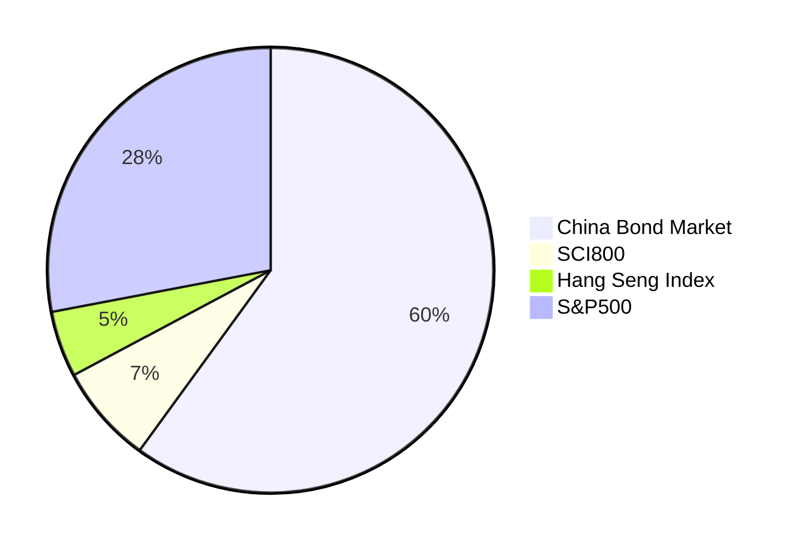
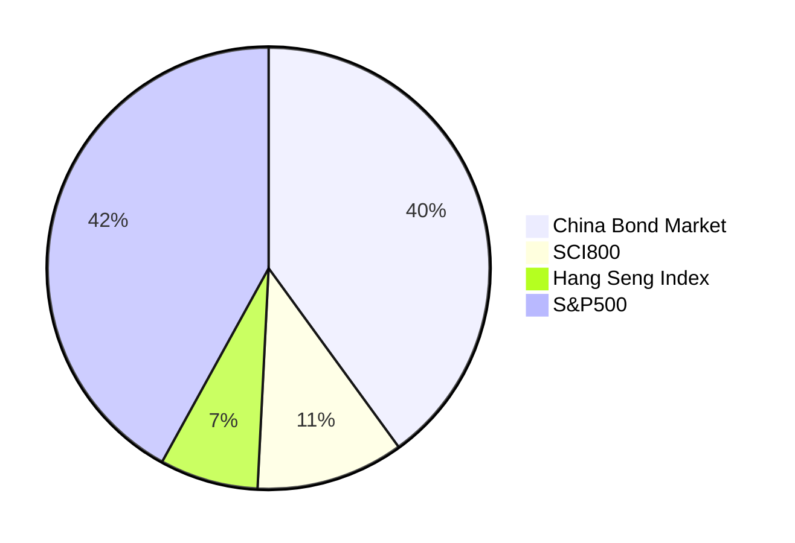
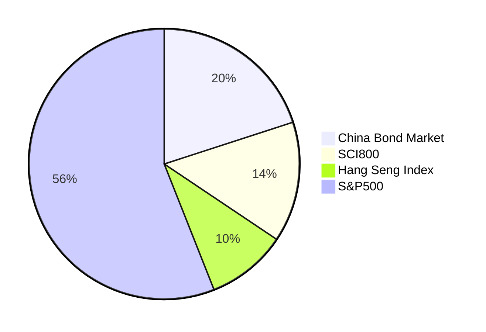
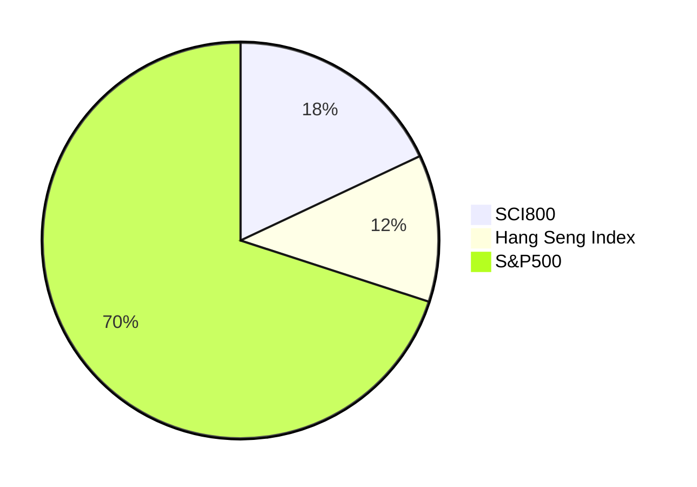

# Couch Potato for Chinese Investors

This note introduces example "couch potato" portfolios for Chinese investors.

**For the average person, a low-cost, indexed, strictly passiv, well-diversified portfolio consisting of bonds and stocks is the best way to invest money.** 

Here are a few takes:

- Periodic contributions and buy-and-hold strategies help overcome behavioral biases that often lead to long-term investment underperformance. 

- Prevailing evidence shows that actively managed funds typically _underperform_ the market after adjusting for fees. 

- Factor returns, discovered through backtesting and data mining, have historically existed, however, emerging evidence indicates that these excess returns tend to _diminish_ following the discovery's publication; I doubt it would be meaningful for average person to take a bet on their persistency at a price of deviating from the cap-weighted version (idiosyncratic risk) and higher fees. 

- Market timing, a common investment pitfall, is one of the worst habits investors tend to fall into. 

- While day trading and cryptocurrency, similar to gambling in casinos, can appear enticing in the digital realm, they often lead to suboptimal financial outcomes.

- Unfortunately, many Chinese investors tend to invest in individual stocks or sector funds, driven by market sentiment. This approach often leads to below-average long-term investment returns.

In Canada, resources like the Canadian Couch Potato[^1] and the Canadian Portfolio Manager[^6] offer great guidance for low-cost, passive, index investing. In the US, the Bogleheads community[^2] advocates for "lazy portfolios," which typically consist of bond and stock index funds (ETFs).

## Available Asset Classes

The meaningful and accessible asset classes for investors in mainland China, available as mutual funds or ETFs[^7], are as follows:

- Domestic Bonds
  - Various segments available, including government, investment grade, high-yield and convertible.
- A Shares (Shanghai & Shenzhen Stock Exchanges)
  - SCI300 index (沪深300), a large-cap index capturing 70% of capitalization.
  - SCI800 index (中证800), large and mid caps accounting for 95% capitalization.
- Hong Kong-listed Stocks
  - Hang Seng Index (恒生指数), a large-cap index for stocks listed in the Hong Kong Stock Exchange representing 60% capitalization.
  - Hang Seng China Enterprises Index (恒生中国企业指数), comprises companies with close business ties to mainland China.
- U.S. Stocks
  - Nasdaq 100 and S&P500 are both available as QDII funds.

## Capital Market Assumptions

The assumptions for return are as follows:

- Bonds: Assume a 1% real return.
- Stocks: Assume a 7% real return.
- Inflation: Assume a 2% inflation rate.

Volatility assumptions primarily use data from the past 10 years of the respective indexes or their equivalents.

Correlation assumptions are based on:

- Data from various high-quality, credible sources
- Verified, cross-checked or computed by me

### Return and Volatility

| Asset Class       | Nominal Return | Volatility (Standard Deviation) |
| ----------------- | -------------: | ------------------------------: |
| China Bond Market |             3% |                              2% |
| A Shares          |             9% |                             24% |
| HK-listed Stocks  |             9% |                             21% |
| U.S. Stocks       |             9% |                             14% |

Note:

1. The returns are nominal, before taxes and fees.
2. Volatility sources are as follows:
   - China Bond Market: Factsheet for S&P China Bond Index
   - China A Shares: Factsheet for MSCI China A Onshore Index
   - HK-listed Stocks: Factsheet for MSCI Hong Kong-listed Southbound Index
   - U.S. Stocks: Factsheet for S&P500 (in CNY)

### Correlation

| Asset Class       | China Bond Market | A Shares | HK-listed Stocks | U.S. Stocks |
| ----------------- | ----------------: | -------: | ---------------: | ----------: |
| China Bond Market |                 1 |      0.2 |              0.2 |         0.2 |
| A Shares          |               0.2 |        1 |             0.72 |        0.45 |
| HK-listed Stocks  |               0.2 |     0.72 |                1 |        0.61 |
| U.S. Stocks       |               0.2 |     0.45 |             0.61 |           1 |

Note:

1. The correlations between bonds and stocks are assumed to be 0.2.
2. The correlation between A shares and Hong Kong-listed stocks is computed by the author based on the volatility data for MSCI Hong Kong-listed Southbound Index, MSCI China A Onshore Index and MSCI Hong Kong-listed Southbound + China A Index.
3. The correlation between A Shares (SCI300) and U.S. Stocks (S&P500) is taken from a research paper [^3].
4. The correlation between Hang Seng Index and S&P500 is taken from a blog post on CFA Institute [^4].

## Representative Funds

The following low-cost index funds that are available for investors in mainland China are selected to represent these four asset classes.

| Asset Class             | Fund Name          | Ticker |
| ----------------------- | ------------------ | ------ |
| China Bond Market       | 易方达中债新综指 A | 161119 |
| A Shares                | 易方达中证 800ETF  | 515810 |
| Hong Kong-Listed Stocks | 华夏沪港通恒生 ETF | 513660 |
| U.S. Stocks             | 博时标普 500ETF    | 513500 |

Note:

1. These are examples; numerous alternatives exist.

## Model Portfolios

The model portfolios are derived from running Markowitz portfolio optimization, with some adjustments.

Allocating a portion to international stocks, especially U.S. equities, is crucial for diversification and volatility reduction [^3].

Those who invest solely in A Shares (or A+H Shares) tend to experience poorer risk-adjusted returns — A standard deviation of 20+% is scary! 

Like investors in other markets[^5], Chinese investors should consider an optimal home bias. Allocating between 50-100% of the equity portion to international stocks (U.S. equity) is advisable. The split between A shares and HK-listed stocks can range from 40/60 to 80/20. The model portfolios suggest an 18/12/70 split for Shanghai & Shenzhen/HK/US, which serves as a good starting point.

### Conservative Portfolio

#### 20% Stocks/80% Bonds

### Balanced Portfolio

#### 40% Stocks/60% Bonds

#### 60% Stocks/40% Bonds

### Growth Portfolio

#### 80% Stocks/20% Bonds

#### 100% Stocks

[^1]: Canadian Couch Potato. <https://canadiancouchpotato.com/>
[^2]: Bogleheads. <https://www.bogleheads.org/>
[^3]:
    S&P Dow Jones Indices. May 2021. Why the S&P 500® Matters to
    China. <https://www.spglobal.com/spdji/en/documents/research/research-why-the-sp-500-matters-to-china.pdf>

[^4]:
    Derek Horstmeyer, Juhee Hong and AnhMinh Luu. 02 November 2021. Chinese and World Stock Market Co-Movements: Two Findings.
    <https://blogs.cfainstitute.org/investor/2021/11/02/chinese-and-world-stock-market-co-movements-two-findings/>

[^5]:
    Vanguard. April 2021. Global equity investing:
    The benefits of diversification
    and sizing your allocation. <https://corporate.vanguard.com/content/dam/corp/research/pdf/Global-equity-investing-The-benefits-of-diversification-and-sizing-your-allocation-US-ISGGEB_042021_Online.pdf>

[^6]: Canadian Portfolio Manager. <https://www.canadianportfoliomanagerblog.com/>

[^7]: Bank deposits and direct real estate investing are "meaningful" options but they are not available as mutual funds or ETFs. Another option is banks' wealth management products (理财产品); they're not as transparent as publicly traded mutual funds. I wouldn't recommend private funds (私募基金) nor private equities (私募股权).
