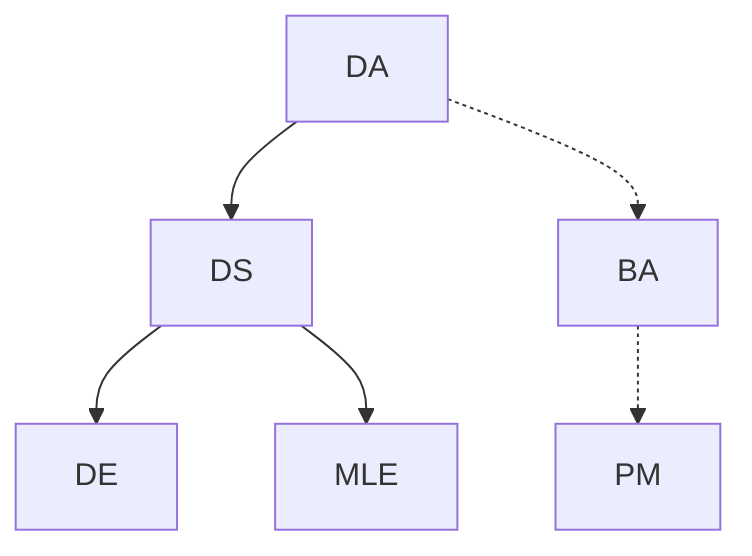

# Data Science Open Courses

A curriculum for data science related roles.

- DA: Data Analyst
- DS: Data Scientist
- DE: Data Engineer
- MLE: Machine Learning Engineer

## Roadmap

Roadmap used in this doc:

For reference:

- AI roadmap: <https://i.am.ai/roadmap>
- AI and Data Scientist Roadmap: <https://roadmap.sh/ai-data-scientist>

## Required background

### Math and stats

- Calculus (for MLE)
- Discrete Math (for DE/MLE)
- Linear Algebra (for DS/DE/MLE)
  - [MIT Open Course](https://ocw.mit.edu/courses/18-06-linear-algebra-spring-2010/)
- Probability and Statistics

### Computer Science

- Python

  - [HarvardX: CS50's Introduction to Programming with Python](https://www.edx.org/learn/python/harvard-university-cs50-s-introduction-to-programming-with-python)

- SQL

  - [The Complete SQL Bootcamp: Go from Zero to Hero](https://www.udemy.com/course/the-complete-sql-bootcamp/)

- Data structures and algorithms (for DE/MLE)

  - [Algorithms Specialization](https://www.coursera.org/specializations/algorithms)

- For DE/MLE:
  - General application development, including backend and APIs
    - Angela Yu's [100 Days of Code](https://www.udemy.com/course/100-days-of-code/) covers this in Python
  - Software Engineering, including
    - Software Development Process
    - Software Architecture & Design
  - Database Design
  - Computer Networks
  - Computer Architecture

## Data Science

Take both:

- [Python for Data Science and Machine Learning Bootcamp](https://www.udemy.com/course/python-for-data-science-and-machine-learning-bootcamp/)

  - _This is the milestone for DA. However, you probably need Excel, Tableau, SAS, Power BI etc. in addition to Python._

- [HarvardX: Introduction to Data Science with Python](https://www.edx.org/learn/data-science/harvard-university-introduction-to-data-science-with-python)
  - Covers the statistics side of data science.
  - Book for reference: [An Introduction to Statistical Learning](https://www.statlearning.com/) (preferably the Python version)

_This is the milestone for DS... Now there are two choices: Data Engineering or MLE. You can, of course, do both. MLE is harder. Sometimes positions prefer those who have graduate degrees. Resources listed here might not be enough. I suggest DE then dive to ML if you're interested..._

## Data Engineering

- [IBM Data Engineering Professional Certificate](https://www.coursera.org/professional-certificates/ibm-data-engineer): ETL, data pipelines & databases

## Cloud Data Engineering

Learn AWS and get these two certificates, in this order:

- AWS Certified Cloud Practitioner
- AWS Certified Solutions Architect - Associate
- AWS Certified Data Engineer - Associate

_This is the milestone for DE. If you're interested, you can dive deep to ML/AI._

## Introduction to AI

[CS50's Introduction to Artificial Intelligence with Python](https://pll.harvard.edu/course/cs50s-introduction-artificial-intelligence-python)

## ML

[Machine Learning Specialization](https://www.coursera.org/specializations/machine-learning-introduction)

## Deep Learning

[Deep Learning Specialization](https://www.coursera.org/specializations/deep-learning)

## NLP

[Natural Language Processing Specialization](https://www.coursera.org/specializations/natural-language-processing)

## MLOps

[Machine Learning Engineering for Production (MLOps) Specialization](https://www.coursera.org/specializations/machine-learning-engineering-for-production-mlops)

_This is the milestone for MLE..._
